=========
Conductor
=========

はじめに
========

本書は、ITAのConductorの機能および操作方法について説明します。

ITA Conductorの概要
===================

| 本章ではConductorメニューの機能、操作方法について説明します。
| Conductorでは、ITAを利用して作業を行う上で共通に必要となる以下の機能を提供します。

ITA Conductorのメニュー、画面構成
=================================

| 本章では、ITA Conductorのメニュー、画面構成について説明します。

ITA Conductorメニュー 一覧
--------------------------

| ITA共通/Conductorのメニューを以下に示します。

.. table:: ITA Conductor画面一覧
   :align: left

   +--------+----------------------+------------------+---------------------------------------------+
   | **No** | **メニューグループ** | **メニュー**     | **説明**                                    |
   |        |                      |                  |                                             |
   |        |                      |                  |                                             |
   |        |                      |                  |                                             |
   |        |                      |                  |                                             |
   |        |                      |                  |                                             |
   |        |                      |                  |                                             |
   +========+======================+==================+=============================================+
   | 1      | Conductor            | Conductorイン\   | Conductorのインターフェース情報をメンテナ\  |
   |        |                      | ターフェース情報 | ンス(閲覧/更新)出来ます。 本メニュー\       |
   |        |                      |                  | は必ず1レコードである必要があります。       |
   +--------+                      +------------------+---------------------------------------------+
   | 2      |                      | Con\             | Conductor\                                  |
   |        |                      | ductor一覧       | をメンテナンス(閲覧/廃止)出来ます。         |
   |        |                      |                  |                                             |
   |        |                      |                  | :guilabel:`詳細` をクリックするとCo\        |
   |        |                      |                  | nductor編集/作業実行メニューに遷移します    |
   +--------+                      +------------------+---------------------------------------------+
   | 3      |                      | Condoctor編集/\  | Conductorを編集/作業実行出来ます。          |
   |        |                      | 作業実行         |                                             |
   +--------+                      +------------------+---------------------------------------------+
   | 4      |                      | C\               | Conductor一覧(実行履歴)を閲覧出来ます。     |
   |        |                      | onductor作業一覧 |                                             |
   |        |                      |                  | :guilabel:`詳細` をクリッ\                  |
   |        |                      |                  | クするとConductor作業確認に遷移します。     |
   +--------+                      +------------------+---------------------------------------------+
   | 5      |                      | C\               | Conductor作業の実行結果を確認出来ます。     |
   |        |                      | onductor作業確認 |                                             |
   +--------+----------------------+------------------+---------------------------------------------+

ITA Conductor利用手順
=====================

作業フロー
----------

| ITA Conductorにおける標準的な作業フローは以下の通りです。

#. 機器情報を登録/確認する(Ansible共通)
#. オペレーションを登録/確認する(基本コンソール)
#. ITAの各DriverからMovementを登録する
#. Movementを確認する(基本コンソール)
#. Conductorのインターフェース情報を登録する
#. Conductorを登録する
#. Conductorを確認する
#. Conductor実行する
#. Conductor実行結果を確認する
#. Conductor実行履歴を確認する

* 「機器情報」の登録方法については、###リンク挿入箇所###「Ansible共通」を参照して下さい。
* 「オペレーション」の登録方法については、「基本コンソール - :ref:`basic_console_operation` 」を参照して下さい。
* Movementの登録方法については、各Driverの利用手順マニュアルを参照して下さい。 
* | Conductor実行時の各 Movementで共有するディレクトリパスが利用可能です。
  | Movement間で情報伝達する必要がある場合、共有するディレクトリパスを利用する事で情報の受け渡しが可能となります。
  | 共有対象については、「Ansible driver」を対象としています。
  | 「Ansible driver」に関する詳細は、###リンク挿入箇所###「Ansible-driver」を参照して下さい。
  .. | 共有対象については、「Ansible driver」と「Terraformdriver」を対象としています。
  .. | 「Ansible driver」に関する詳細は、別紙、「利用手順マニュアルAnsible-driver」を参照して下さい。
  .. | 「Terraform driver」に関する詳細は、別紙、「利用手順マニュアルTerraform-driver」を参照して下さい。
* 「Conductor call」で実行した作業フローについては、それぞれ個別に共有ディレクトリパスを持ちます。（作業フローを跨いでいるMovemetについては、共有の対象外となります。）

機能・操作方法説明
==================

ITA Conductor
-------------

Conductorインターフェース情報
~~~~~~~~~~~~~~~~~~~~~~~~~~~~~

#. 「Conductorインターフェース情報」メニューでは、Conductorから実行される各Movementで共有するディレクトリのパスと「Conductor作業確認」メニューのリフレッシュ間隔を設定します。

#. 「Conductorインターフェース情報」メニュー -「一覧」サブメニューの詳細は以下の通りです。

   .. table:: 「一覧」サブメニュー
      :widths: 10 30 8 8 8
      :align: left

      +-----------------------------+----------------------------------------------------------------------------------------------------------------------------+----------+-----------+-------------------+
      | 項目                        | 説明                                                                                                                       | 入力必須 | 入力形式  | 制約事項          |
      +=============================+============================================================================================================================+==========+===========+===================+
      | ConductorインターフェースID |  **{{#:1 こちらに入る説明内容の記入をお願い致します。}}**                                                                  |          | 自動入力  |                   |
      +-----------------------------+----------------------------------------------------------------------------------------------------------------------------+----------+-----------+-------------------+
      | 状態監視周期（単位ミリ秒）  |  「Conductor作業実行」の表示をリフレッシュする間隔を入力します。通常は3000ミリ秒程\                                        |  ○       | 手動入力  | 最小値1000ミリ秒  |
      |                             |  度が推奨値です。                                                                                                          |          |           |                   |
      +-----------------------------+----------------------------------------------------------------------------------------------------------------------------+----------+-----------+-------------------+
      | 備考                        | 自由記述欄です。                                                                                                           | -        | 手動入力  | -                 |
      +-----------------------------+----------------------------------------------------------------------------------------------------------------------------+----------+-----------+-------------------+

Conductor一覧
~~~~~~~~~~~~~

#. 「Conductor一覧」メニューでは、登録済みのConductorを参照/廃止出来ます。

   | 「一覧」サブメニューの :guilabel:`詳細` をクリックすると、 :ref:`conductor_editandexcute` 画面へ遷移出来ます。

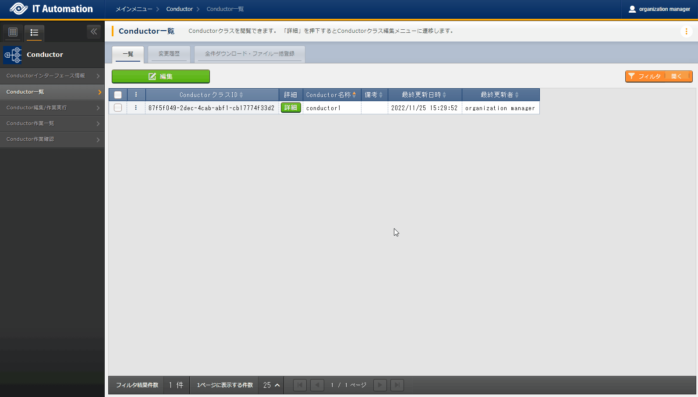

   「Conductor一覧」メニュー

.. _conductor_editandexcute:
Conductor編集/作業実行
~~~~~~~~~~~~~~~~~~~~~~

「Conductor編集」について
*************************

.. table:: モード一覧
   :align: left

   +------------+---------------------------------------------------------------------------------------------------------+
   | **モード** | **説明**                                                                                                |
   +============+=========================================================================================================+
   | 編集\      | * 新規Conductorを作成できるモード                                                                       |
   | モード     |                                                                                                         |
   |            | * 「Conductor編集/作業実行」メニューのデフォルトのモード                                                         |
   |            |                                                                                                         |
   |            | * 編集モードから :guilabel:`選択` クリック後に任意のConductorを選択することで、閲覧モードへ変更         |
   +------------+---------------------------------------------------------------------------------------------------------+
   | 閲覧\      | * Conductorを閲覧のみできるモード                                                                       |
   | モード     |                                                                                                         |
   |            | * 「Conductor一覧」メニューの :guilabel:`詳細` から画面遷移後のモード                                   |
   |            |                                                                                                         |
   |            | * 閲覧モードから :guilabel:`編集` クリック後に、更新モードへ変更                                        |
   +------------+---------------------------------------------------------------------------------------------------------+
   | 更新\      | * 既存のConductorを編集できるモード                                                                     |
   | モード     |                                                                                                         |
   |            | * 更新モードから :guilabel:`更新` クリック後に、閲覧モードへ変更                                        |
   +------------+---------------------------------------------------------------------------------------------------------+

| ※各モードで可能な操作については「 :ref:`conductor_editandexcute_list` 」を参照。

* 選択したNodeにより、画面右上（詳細情報）に表示される内容が変わります。
  
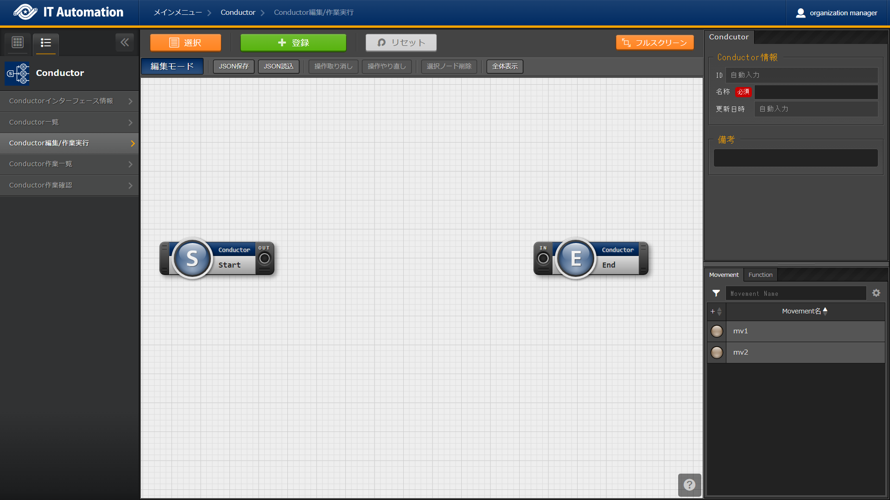

   Conductor編集/作業実行メニュー画面(編集モード)

Node一覧
^^^^^^^^

* 画面右側下部の領域には、利用可能なNodeが表示されます。
* 以下のタブから構成されます。

  * Movementタブ
  
    * 登録済みのMovementのIDと名称の一覧

  * Functionタブ
  
    * Conductor end
    * Conductor pause
    * Conductor call
    * Symphony call
    * Conditional branch
    * Parallel branch
    * Parallel merge
    * Status File branch

* 各Nodeについて、詳細は以下の通りです。

.. table:: Node一覧
   :widths: 10 10 30
   :align: left

   +----------------+------------------------------+-----------------------------------+
   | **画像**       | **名称**                     | **動作説明**                      |
   +================+==============================+===================================+
   | |image1|       | Conductor start              | Conductorを開始します             |
   +----------------+------------------------------+-----------------------------------+
   | |image2|       | Conductor end                | Conductor終了します。             |
   |                |                              |                                   |
   |                |                              | ※複数のConductor \                |
   |                |                              | endがある場合、全てのConductor \  |
   |                |                              | endが終了を待ちます。             |
   +----------------+------------------------------+-----------------------------------+
   | |image3|       | Conductor pause              | ワークフローを一時停止します。    |
   |                |                              |                                   |
   |                |                              | 一時停止を\                       |
   |                |                              | 解除すると、次の処理へ進みます。  |
   +----------------+------------------------------+-----------------------------------+
   | |image4|       | Conductor call               | 別の登録済みのCond\               |
   |                |                              | uctorを呼び出し実行します。       |
   |                |                              |                                   |
   |                |                              | ※\                                |
   |                |                              | 呼び出し先のConductorが警告終了で\|
   |                |                              | 終了した場合、正常終了と同じよう\ |
   |                |                              | に後続の処理を実行して、呼び出し\ |
   |                |                              | 元のステータスには影響しません。  |
   +----------------+------------------------------+-----------------------------------+
   | |image6|       | Conditional branch           | 接続\                             |
   |                |                              | された、「Movement」、「Conducto\ |
   |                |                              | r call」\                         |
   |                |                              | の結果によ\                       |
   |                |                              | って、後続の処理を分岐させます。  |
   |                |                              |                                   |
   |                |                              | 指定可能\                         |
   |                |                              | なステータスは、以下になります。  |
   |                |                              |                                   |
   |                |                              | ・正常終了                        |
   |                |                              |                                   |
   |                |                              | ・異常終了                        |
   |                |                              |                                   |
   |                |                              | ・緊急停止                        |
   |                |                              |                                   |
   |                |                              | ・準備エラー                      |
   |                |                              |                                   |
   |                |                              | ・想定外エラー                    |
   |                |                              |                                   |
   |                |                              | ・SKIP完了                        |
   |                |                              |                                   |
   |                |                              | ・警告終了                        |
   +----------------+------------------------------+-----------------------------------+
   | |image7|       | Parallel branch              | 並\                               |
   |                |                              | 列して、「Movement」、「Conducto\ |
   |                |                              | r call」\                         |
   |                |                              | を実行します。                    |
   |                |                              |                                   |
   |                |                              | ※並列可能な実行数は、ITAの構成\   |
   |                |                              | やサーバースペックに依存します。  |
   +----------------+------------------------------+-----------------------------------+
   | |image8|       | Parallel merge               | 接続している全Nodeの処理\         |
   |                |                              | が完了後、次の処理を実行します。  |
   +----------------+------------------------------+-----------------------------------+
   | |image9|       | Status file branch           | 接続された、「\                   |
   |                |                              | Movement」の作業結果ディレクトリ\ |
   |                |                              | 内のステータスファイルの内容によ\ |
   |                |                              | って、後続の処理を分岐させます。  |
   +----------------+------------------------------+-----------------------------------+
   | |image10|      | Movement各種                 | Movementを実行します。            |
   +----------------+------------------------------+-----------------------------------+

* Nodeにおける制約事項は以下の通りです。

  * 登録/更新を行うには、全てのNodeのIN/OUTが接続されている必要があります。
  .. figure:: ./conductor/image17.png
      :width: 600px
      :alt: Node制約事項（正常例：Parallel branch）

      Node制約事項（正常例：Parallel branch）

  * Parallel mergeを使用する場合、Parallel branchを使用している必要があります。
  .. figure:: ./conductor/image18.png
     :width: 600px
     :alt: Node制約事項（NG例：Parallel branch）

     Node制約事項（NG例：Parallel branch）

  * Conditional branch で分岐されたフローについてParallel mergeでマージする事はできません。
  .. figure:: ./conductor/image19.png
     :width: 600px
     :alt: Node制約事項（NG例：Conditional branch）

     Node制約事項（NG例：Conditional branch）

  * Parallel branch、Conditional branch、Parallel merge、Conductor pauseについて、連続して同じ種類のNodeを接続する事はできません。
  .. figure:: ./conductor/image20.png
     :width: 600px
     :alt: Node制約事項（NG例：連続使用）

     Node制約事項（NG例：連続使用）

  * Conductor callについて、更新中のConductorをConductor callで指定し、更新することはできません。
  .. figure:: ./conductor/image21.png
     :width: 600px
     :alt: Node制約事項（NG例：Conductor call）

     Node制約事項（NG例：Conductor call）

  * 各NodeをNode一覧からドラッグ&ドロップで追加することが可能です。
 
  * Node選択時、画面右上（詳細情報）に表示される「備考」欄には、処理説明やコメントをメモすることが可能です。

  * 「備考」欄の記述は処理実行に影響はありません。Web上でのみ参照できるメモ欄です。

  * Node設定後、:guilabel:`+登録` をクリックしてConductorを登録します。

詳細情報
^^^^^^^^
* 画面右側上部の領域には、選択しているNodeの詳細情報が表示されます。
* 選択しているNodeによってタブの名称が変わります。

  #. Node未選択時（Conductorタブ）

     *  Node未選択の場合表示されます。

     *  タブ内の項目は以下の通りです。

     .. list-table:: 「Conductor」タブ
        :widths: 5 30 5 5 5
        :header-rows: 1
        :align: left
        
        * - **項目**
          - **説明**
          - **入力必須**
          - **入力形式**
          - **制約事項**
        * - ID
          - Conductorに対応した一意のIDが自動入力されます。
          - \-
          - 自動入力
          - \-
        * - 名称 
          - 任意のConductor名称を入力します。
          - ○
          - 手動入力
          - \-
        * - 更新日時 
          - 選択したConductorが更新された日時が自動入力されます。
          - \-
          - 自動入力
          - \-
        * - 備考 
          - Conductorに対する説明やコメントを入力します。
          - \-
          - 手動入力
          - \-

  #. Movement選択時（Movementタブ）
  
     * 「Node一覧」における「Movement」タブ内のNodeを選択した場合表示されます。
     * タブ名は選択したMovementのオーケストレータ名が表示されます。
     * タブ内の項目は以下の通りです。
  
     .. list-table:: 「Movement」タブ
        :widths: 10 30 5 5 5
        :header-rows: 1
        :align: left
        
        * - **項目**
          - **説明**
          - **入力必須**
          - **入力形式**
          - **制約事項**
        * - Movement ID
          - 選択したMovementのIDが表示されます。
          - \-
          - 自動入力
          - \-
        * - 名称
          - 選択したMovementの名称が表示されます。
          - \-
          - 自動入力
          - \-
        * - スキップ
          - 対象作業をスキップする場合にチェックします。「Conductor作業実行」メニューにて、変更可能なパラメータです。
          - \-
          - 手動入力
          - \-
        * - 個別オペレーション
          - | :guilabel:`オペレーション選択` クリックして表示される一覧から任意の値を選択出来ます。
            | 選択したオペレーション名が表示されます。
          - \-
          - 選択
          - \-
        * - 備考
          - Nodeに対する説明やコメントを入力出来ます。
          - \-
          - 手動入力
          - \-

  #. Conductor start/Conductor pause選択時（Functionタブ）
  
     * 「Node一覧」における「Function」タブ内の「Conductor start」「Conductor end」「Conductor pause」を選択した場合表示されます。
     * タブ内の項目は以下の通りです。
  
     .. list-table:: 「Function」タブ
        :widths: 10 30 5 5 5
        :header-rows: 1
        :align: left
        
        * - **項目**
          - **説明**
          - **入力必須**
          - **入力形式**
          - **制約事項**
        * - 備考
          - Nodeに対する説明やコメントを入力出来ます。
          - \-
          - 手動入力
          - \-
  
  
  #. Conductor call選択時（Conductor callタブ）
  
     * 「Node一覧」における「Function」タブ内の「Conductor call」を選択した場合表示されます。
     * タブ内の項目は以下の通りです。
  
     .. list-table:: 「Conductor call」タブ
        :widths: 10 30 5 5 5
        :header-rows: 1
        :align: left
        
        * - **項目**
          - **説明**
          - **入力必須**
          - **入力形式**
          - **制約事項**
        * - スキップ
          - | 対象作業をスキップする場合にチェックします。
            | Conductor作業実行画面にて、変更可能なパラメータです。
          - \-
          - ラジオボタン
          - \-
        * - 呼び出しConductor
          - | :guilabel:`Conductor選択` をクリックして表示される一覧からConductorを選択出来ます。
            | 指定したConductor名称が表示されます。
          - \-
          - 選択
          - \-
        * - 個別オペレーション
          - | :guilabel:`オペレーション選択` をクリックして表示される一覧から、任意のオペレーションを選択出来ます。
            | 指定したオペレーション名が表示されます。
          - \-
          - 選択
          - \-
        * - Note
          - Nodeに対する説明やコメントを入力出来ます。
          - \-
          - 手動入力
          - \-
  
  #. Conditional branch選択時（Conditional branchタブ）
  
     * 「Node一覧」における「Function」タブ内の「Conditional branch」を選択した場合表示されます。
     * タブ内の項目は以下の通りです。
    
  
     .. table:: 「Conditional branch」タブ
        :align: left
  
        +------+----------------------------------------------+---------------+---------+---------+
        | **項\| **説明**                                     | **入力形式**  | **入力\ | **制約\ |
        | 目** |                                              |               | 形式**  | 事項**  |
        |      |                                              |               |         |         |
        |      |                                              |               |         |         |
        |      |                                              |               |         |         |
        |      |                                              |               |         |         |
        |      |                                              |               |         |         |
        |      |                                              |               |         |         |
        |      |                                              |               |         |         |
        +======+==============================================+===============+=========+=========+
        | case\| Movement、Conductor                          | -             | 選択    | ※       |
        | (\   | call\                                        |               |         |         |
        | 1-6) | の実行\                                      |               |         |         |
        |      | 結果による条件分岐を設定します。             |               |         |         |
        |      |                                              |               |         |         |
        |      | ドラッグアン\                                |               |         |         |
        |      | ドドロップで設定を変更出来ます。             |               |         |         |
        |      |                                              |               |         |         |
        |      | デフォルトは以下の通りです。                 |               |         |         |
        |      |                                              |               |         |         |
        |      | +-----------------+-----------------------+  |               |         |         |
        |      | | **case1**       | 正常終了              |  |               |         |         |
        |      | |                 |                       |  |               |         |         |
        |      | |                 |                       |  |               |         |         |
        |      | +-----------------+-----------------------+  |               |         |         |
        |      | | **Other**       | 異常\                 |  |               |         |         |
        |      | |                 | 終了、緊急停止、準備\ |  |               |         |         |
        |      | |                 | エラー、想定外エラー\ |  |               |         |         |
        |      | |                 | 、Skip完了、警告終了  |  |               |         |         |
        |      | +-----------------+-----------------------+  |               |         |         |
        +------+----------------------------------------------+---------------+---------+---------+
        | 備考 | Nodeに対す\                                  | -             | 手\     | -       |
        |      | る説明やコメントを入力出来ます。             |               | 動入力  |         |
        +------+----------------------------------------------+---------------+---------+---------+
  
    
  
  
  #. Parallel branch選択時（Parallel branchタブ）
  
     * 「Node一覧」における「Function」タブ内の「Parallelbranch」を選択した場合表示されます。
     * タブ内の項目は以下の通りです。
  
     .. list-table:: 「Parallel branch」タブ
        :widths: 10 30 5 5 5
        :header-rows: 1
        :align: left
        
        * - **項目**
          - **説明**
          - **入力必須**
          - **入力形式**
          - **制約事項**
        * - 平行分岐設定
          - | 分岐数を設定します。 :guilabel:`分岐追加` / :guilabel:`分岐削除` をクリックして、分岐を増減します。
            | デフォルトの分岐数は2です。2以下の値は設定できません。
          - \-
          - 選択
          - \-
        * - 備考
          - Nodeに対する説明やコメントを入力出来ます。
          - \-
          - 手動入力
          - \-
  
  
  #. Parallel Merge選択時(Parallel Mergeタブ)
  
     * 「Node一覧」における「Function」タブ内の「Parallel merge」を選択した場合表示されます。
     * タブ内の項目は以下の通りです。
  
     .. list-table:: 「Parallel Merge」タブ
        :widths: 10 30 5 5 5
        :header-rows: 1
        :align: left
        
        * - **項目**
          - **説明**
          - **入力必須**
          - **入力形式**
          - **制約事項**
        * - case
          - | 分岐数を設定します。 :guilabel:`マージ追加` / :guilabel:`マージ削除` クリックして、分岐を増減します。
            | デフォルトの分岐数は2です。2以下の値は設定できません。
          - \-
          - 選択
          - \-
        * - 備考
          - Nodeに対する説明やコメントを入力出来ます。
          - \-
          - 手動入力
          - \-
  
  
  #. Conductor end選択時（Endタブ）
  
     * 「Node一覧」における「Function」タブ内の「Conductor end」を選択した場合表示されます。
     * タブ内の項目は以下の通りです。
  
     .. list-table:: 「End」タブ
        :widths: 10 30 5 5 5
        :header-rows: 1
        :align: left
        
        * - **項目**
          - **説明**
          - **入力必須**
          - **入力形式**
          - **制約事項**
        * - 終了ステータス
          - | Endまで処理された際に、選択されたステータスが、Conductorのステータスへ反映されます。
            | - 正常 (デフォルト値)  
            | - 警告 
            | - 異常  
            | 
            | 複数のEndノードまで処理された場合、反映されるステータスの優先度は以下です。
            |  優先度： 正常 < 警告 < 異常
          - \-
          - 選択
          - \-
        * - 備考
          - Nodeに対する説明やコメントを入力出来ます。
          - \-
          - 手動入力
          - \-
  
  
  #. Status file branch選択時（Status file branchタブ）
  
     * 「Node一覧」における「Function」タブ内の「Status file branch」を選択した場合表示されます。
     * タブ内の項目は以下の通りです。
  
     .. list-table:: 「Status file branch」タブ
        :widths: 10 30 5 5 5
        :header-rows: 1
        :align: left
        
        * - **項目**
          - **説明**
          - **入力必須**
          - **入力形式**
          - **制約事項**
        * - ステータスファイル分岐設定
          - | Movement のステータスファイルによる条件分岐を設定します。
            |  :guilabel:`条件追加`  /  :guilabel:`条件削除` をクリックして、分岐を増減します。
            | デフォルトの分岐は「if」と「else」です。
          - \-
          - 選択
          - \-
        * - 備考
          - Nodeに対する説明やコメントを入力出来ます。
          - \-
          - 手動入力
          - \-
  
     .. note:: | **参照するステータスファイルについて**
  
      * 参照するステータスファイルは、各Movmentの作業結果ディレクトリ配下の「MOVEMENT_STATUS_FILE」を参照します。
      * ステータスファイルが存在しない場合、「else」側の処理を行います。
      * ステータスファイル内の内容が、複数行（改行コードを含む）場合、改行コード以降は、除外した値を評価対象とします。
      | 例）改行含むステータスファイルの内容
  
      .. code-block:: 
  
         1
  
         23
  
         4
  
      | ステータスファイルの内容として、「1」として、評価を行います。
  
      .. list-table:: ステータスファイルITA独自変数
         :widths: 15 25 5
         :header-rows: 1
         :align: left
          
         * - **ITA独自変数**
           - **変数指定内容**
           - **制約事項**
         * - __movement_status_filepath__ 
           - 作業結果ディレクトリ配下の「MOVEMENT_STATUS_FILE」のパス
           - ※
  
      | ※ **###リンク挿入箇所###** 「Ansible-LegacyRole」で対応しています。
  
  #. 「Node」タブ
  
     * 「Node一覧」における「Movement」タブおよび「Function」タブ内のNodeを複数選択した場合表示されます。
     * グリッド内の整列をすることが可能になります。
     * Nodeを複数選択する方法については、ドラッグアンドドロップでの範囲選択の他、「shift」キーをクリックしながらの選択が可能です。
     * タブ内の項目は以下の通りです。
     
     .. figure:: ./conductor/align-nodes.gif
        :width: 800px
        :alt: Nodeの整列

        Nodeの整列

     .. list-table:: 「Node」タブ
        :widths: 10 30 5 5 5
        :header-rows: 1
        :align: left
        
        * - **項目**
          - **説明**
          - **入力必須**
          - **入力形式**
          - **制約事項**
        * - |image11|
          - 複数選択したNodeを左揃えに整列します。
          - \-
          - 選択
          - \-
        * - |image12|
          - 複数選択したNodeを左右中央揃えに整列します。
          - \-
          - 選択
          - \-
        * - |image13|
          - 複数選択したNodeを右揃えに整列します。
          - \-
          - 選択
          - \-
        * - |image14|
          - 複数選択したNodeを上揃えに整列します。
          - \-
          - 選択
          - \-
        * - |image15|
          - 複数選択したNodeを上下中央揃えに整列します。
          - \-
          - 選択
          - \-
        * - |image16|
          - 複数選択したNodeを下揃えに整列します。
          - \-
          - 選択
          - \-
        * - |image17|
          - 複数選択したNodeを左右等間隔にします。
          - \-
          - 選択
          - \-
        * - |image18|
          - 複数選択したNodeを上下等間隔にします。
          - \-
          - 選択
          - \-
  

* 「Conductor編集/作業実行」メニューで実行可能な操作は以下の通りです。

.. _conductor_editandexcute_list:
.. table:: 「Conductor編集/作業実行」メニュー実行操作一覧
   :align: left

   +-------------+-----------------------------------+----------+---------+---------+------+
   | **項目**    | **説明**                          | **新規** | **更新**          | **備 |
   |             |                                   |          |                   | 考** |
   |             |                                   |          |                   |      |
   |             |                                   |          |                   |      |
   |             |                                   +----------+---------+---------+      |
   |             |                                   | **EDIT** | **VIEW**| **EDIT**|      |
   |             |                                   |          |         |         |      |
   |             |                                   |          |         |         |      |
   |             |                                   |          |         |         |      |
   +=============+===================================+==========+=========+=========+======+
   | JSON保存    | **{{#2:こちらに入る説明文の記入\  | 〇       |         |         |      |
   |             | をお願い致します}}**              |          |         |         |      |
   +-------------+-----------------------------------+----------+---------+---------+------+
   | JSON読\     | **{{#3:こちらに入る説明文の記入\  |   〇     |         |         |      |
   | 込          | をお願い致します}}**              |          |         |         |      |
   +-------------+-----------------------------------+----------+---------+---------+------+
   | 操作取\     | 直前の処理を取り消します。        | 〇       |         |  〇     |      |
   | り消し      |                                   |          |         |         |      |
   +-------------+-----------------------------------+----------+---------+---------+------+
   | 操作や\     | 直前の取り消しをやり直します。    | 〇       |         | 〇      |      |
   | り直し      |                                   |          |         |         |      |
   +-------------+-----------------------------------+----------+---------+---------+------+
   | 選択ノー\   | 選択しているNodeを削除します。    | 〇       |         | 〇      |      |
   | ド削除      |                                   |          |         |         |      |
   +-------------+-----------------------------------+----------+---------+---------+------+
   | 登録        | 登録を実施します。                | 〇       |         | 〇      |      |
   +-------------+-----------------------------------+----------+---------+---------+------+
   | リセット    | 初期状態へ戻します。              |  〇      |         |         |      |
   +-------------+-----------------------------------+----------+---------+---------+------+
   | 編集        | EDITモードへ変\                   |          | 〇      | 〇      |      |
   |             | 更し、Conductorの編集を行います。 |          |         |         |      |
   +-------------+-----------------------------------+----------+---------+---------+------+
   | 流\         | 登録済のConducto\                 |          | 〇      |  〇     |      |
   | 用新規      | rを流用して、新規作成が行えます。 |          |         |         |      |
   +-------------+-----------------------------------+----------+---------+---------+------+
   | 更新        | 編集内容を更新します。            |          |         |  〇     |      |
   +-------------+-----------------------------------+----------+---------+---------+------+
   | 再読込      | 変更をキャン\                     |          |         | 〇      |      |
   |             | セルし、変更前の状態へ戻します。  |          |         |         |      |
   +-------------+-----------------------------------+----------+---------+---------+------+
   | キャ\       | 変更をキャン\                     |          |         | 〇      |      |
   | ンセル      | セルし、VIEWモードへ変更します。  |          |         |         |      |
   +-------------+-----------------------------------+----------+---------+---------+------+

「閲覧」モードについて
**********************

| 「Conductor一覧」メニューから遷移した場合や、登録が完了した場合は、以下の画面が表示されます。

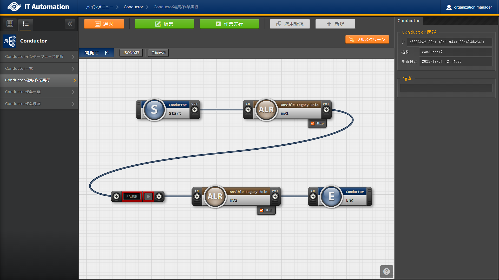

   「Conductor編集/作業実行」メニュー（「閲覧」モード）

.. list-table:: 「閲覧」モード
   :widths: 10 30 
   :header-rows: 1
   :align: left
   
   * - **項目**
     - **説明**
   * - :guilabel:`選択`
     - 登録済みのConductorを選択して閲覧出来ます。
   * - :guilabel:`編集`
     - 登録済みのConductorを編集出来ます。
   * - :guilabel:`作業実行`
     - 選択したConductorの作業実行を行います。
   * - :guilabel:`流用新規`
     - 登録済みのConductorをコピーして新規作成が行えます。
   * - :guilabel:`新規`
     - Conductorの新規作成が行えます。

「更新」モードについて
**********************

| 閲覧モードにて :guilabel:`編集` をクリックした場合は、以下の画面が表示されます。

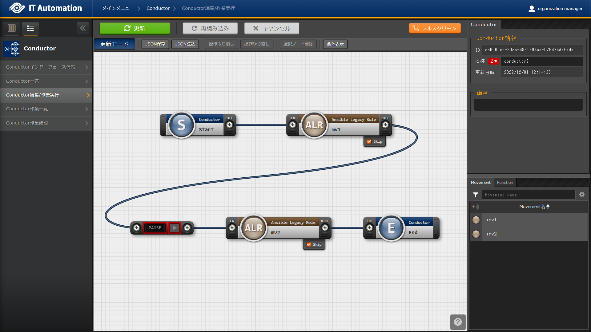

   「Conductor編集/作業実行」メニュー（「更新」モード）

.. list-table:: 「更新」モード
   :widths: 10 30 
   :header-rows: 1
   :align: left
   
   * - **項目**
     - **説明**
   * - :guilabel:`更新`
     - 編集内容が保存されます。
   * - :guilabel:`再読み込み`
     - 編集内容が破棄されて登録内容の状態に戻ります。
   * - :guilabel:`キャンセル`
     - :guilabel:`編集` クリック前の状態に戻ります。
   * - :guilabel:`フルスクリーン`
     - | ブラウザの表示がフルスクリーンになります。
       | ※フルスクリーン時は :guilabel:`フルスクリーン解除` に変わります。
   * - :guilabel:`全体表示`
     - Node すべてが表示される縮尺で表示されます。

Conductor作業実行について
*************************

| 閲覧モードにて、 :guilabel:`作業実行` をクリックすると作業実行設定画面が表示されます。

* | :guilabel:`オペレーション選択` をクリックすると、「基本コンソール」メニューグループ > 「オペレーション一覧」メニューで登録したオペレーションが表示されます。
  | ※「基本コンソール -  :ref:`basic_console_operation` 」を参照。
* オペレーションを選択し :guilabel:`実行` をクリックすると「Conductor作業確認」に遷移し、作業のトレースが始まります。
* | 「スケジュール」にて予約日時を入力して :guilabel:`実行` をクリックすると、作業予約が作られます。登録情報は「 :ref:`conductor_conductor_job_list` 」で確認出来ます。
  | ※現在時刻より過去の日時は入力できません
* | Movement、Conductor Callのオペレーション, スキップのみ、設定値を変更可能です。
  | ※Conductor編集で登録したデータへ変更は反映されません。作業実行にのみ反映されます。
* 実行したConductorに設定されるアクセス権について、実行時に選択したConductor、オペレーションに設定されたアクセス権の共通するロールを継承します。共通するロールが存在しない場合、作業実行できません。

* 「作業実行設定」共通項目は以下の通りです。

.. list-table:: 「作業実行設定」共通項目一覧
      :widths: 10 25 5 5 5
      :header-rows: 1
      :align: left
      
      * - **項目**
        - **説明**
        - **入力必須**
        - **入力形式**
        - **制約事項**
      * - 作業実行 Conductor
        - 選択したしたConductorが表示されます。
        - \-
        - 自動入力
        - 
      * - オペレーション
        - :guilabel:`オペレーション選択` をクリックし、オペレーションを選択します。
        - ○
        - 選択
        - 
      * - スケジュール
        - Conductorの実行予定日時を指定します。
        - \-
        - 手動入力
        - 現在時刻より過去の日時は入力不可
      * - 作業実行
        - 登録したConductorを実行します。 
        - ○
        - ボタン

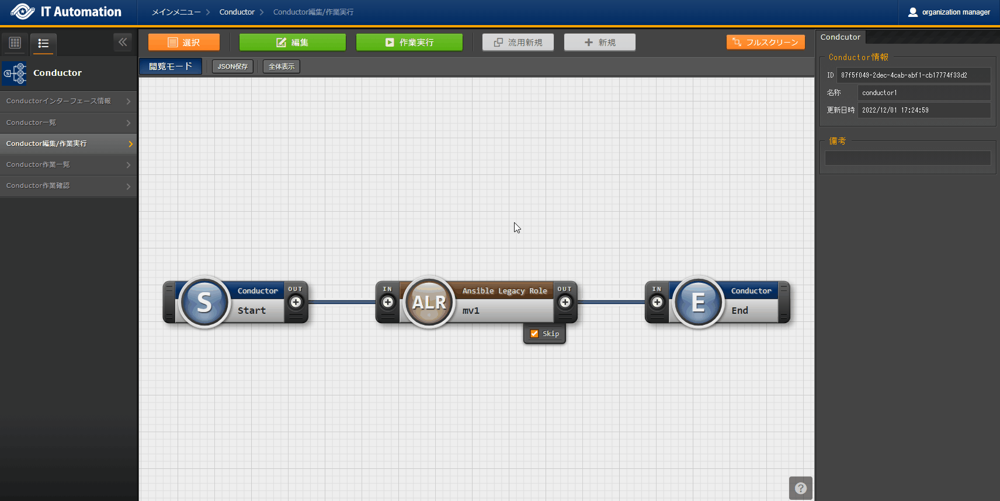

.. tip:: | **オペレーションの指定について**
   | グリッド内の「Movement」Nodeを選択し、 :guilabel:`オペレーション選択` をクリックすると、オペレーションのリストが表示されます。
   | 作業実行設定画面のラジオボタンで指定したオペレーションのオペレーションIDとは別のオペレーションを指定することが出来ます。
   | これにより、そのMovementの属するオーケストレータの「代入値管理」メニュー（例：###リンク挿入箇所###ITAAnsible-Legacyコンソールの「代入値管理」メニュー）で、ほかのオペレーションIDのものとして登録した「具体値」を代入して実行することが出来ます。
   | Conductor編集画面で個別指定したオペレーションIDはConductor :guilabel:`登録` / :guilabel:`更新` により設定が保存されます。
   | また、Conductor実行画面でも実行前に個別指定ができ、既に :ref:`conductor_editandexcute` で個別指定登録をして保存されているオペレーションIDについても更に変更を行いConductor実行することが出来ます。
   | ただし、Conductor実行画面で個別指定したオペレーションIDは実行時のみの反映となり、設定は保存されません。
   | 同じMovementを流用し、別なサーバを操作したい時などにご活用下さい。
   |
   | **スキップについて**
   | スキップのチェックを変更することが出来ます。
   | 編集/更新モードでスキップの設定は :guilabel:`登録` / :guilabel:`更新` により設定が保存されます。
   | また、閲覧モードでも実行前に個別指定ができ、既にConductor編集で保存されているスキップについて変更を行いConductor実行することが出来ます。
   | ただし、閲覧モードでは実行時のみの反映となり、設定は保存されません。
   | 一時的に、処理を飛ばして、又は実施して、作業実行したい時などにご活用下さい。
   | 
   | **実行する作業のアクセス権限について**
   | 「 :ref:`conductor_editandexcute` 」メニューに表示された「Movement」および「Conductor Call」内で呼び出されるすべての作業および個別指定されたオペレーションについて、アクセス権限が無い対象が一つでも含まれている場合は :guilabel:`実行` をクリックした際にバリデーションエラーになります。

.. _conductor_conductor_job_list:
Conductor作業一覧
~~~~~~~~~~~~~~~~~

#. | [Conductor作業一覧]画面では、実行済みのConductorの作業を管理します。
   | 条件を指定し「フィルタ」ボタンをクリックすると、作業一覧テーブルを表示します。
   | 作業表示欄の「詳細」ボタンをクリックすると、 :ref:`conductor_check_conductor_job` 画面へ遷移します。
   | :guilabel:`投入データ一式(zip)` をクリックすると、実行された全てのConductor配下のMovement(*)の実行ファイルなどをまとめてダウンロードすることが出来ます。
   | :guilabel:`結果データ一式(zip)` をクリックすると、実行された全てのConductor配下のMovement(*)の実行ログ、エラーログなどをまとめてダウンロードすることが出来ます。
   | 通知ログ欄から、通知の実行ログをダウンロードすることが出来ます。
   | ログの出力例は、「 :ref:`conductor_notification_log` 」を参照して下さい。
   
   | ※Conductorが階層構造になっている場合は、末端のMovementも対象になります。

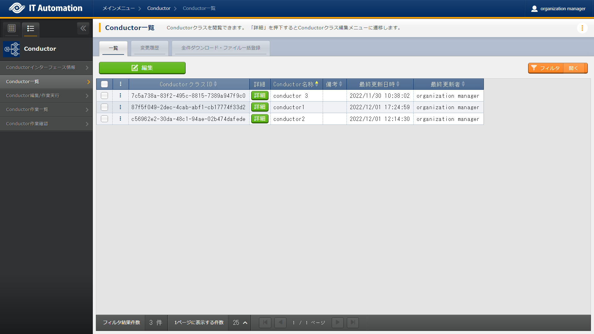
   
   「Conductor作業一覧」メニュー

.. _conductor_check_conductor_job:
Conductor作業確認
~~~~~~~~~~~~~~~~~
| 「Conductor作業確認」メニューでは、Conductorの実行状態を表示します。

*  実行中以降のステータスになっている実行状況サークルをクリックすると、各ドライバの「作業状態確認」メニューに遷移し作業実行状況の詳細を確認することが可能です。
*  | 「 :ref:`conductor_conductor_job_list` 」の :guilabel:`詳細` をクリックすると、選択したConductor作業の処理状況をモニター表示します。状況に応じて「予約取消」、「停止解除」や「緊急停止」の投入が可能です。
   | ※「Movement」、「Conductor Call」のNodeについては、Node選択後に、画面右側に表示される :guilabel:`作業情報確認` からも「作業状態確認」メニューに遷移出来ます。
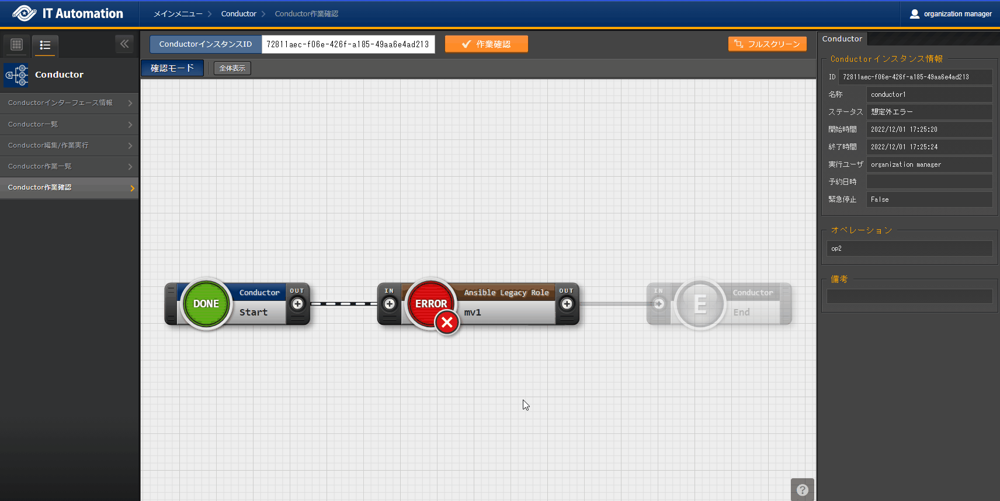

   作業状態確認

.. tip:: | 「Conductor作業実行」メニューで実行した、作業実行済みのConductorを「 :ref:`conductor_editandexcute` 」メニューで編集すると、作業実行時のConductorと異なる状態となるため「詳細」ボタンをクリックしても処理状況が表示されない場合があります。
   | 作業実行済みのConductorを編集して再度実行する場合は、「Conductor編集/作業実行」メニューの :guilabel:`流用新規` にて、別のConductorを作成してご利用いただくことを推奨します。
* 選択したConductor作業に予約日時が設定されていて、かつ未実行の場合は、 :guilabel:`予約取消` が表示されます。
*  :guilabel:`予約取消` をクリックすると、「 :ref:`conductor_conductor_job_list` 」で確認できるステータスが「予約取消」となり、実行されなくなります。

* 「Conductor作業確認」メニューの共通項目は以下の通りです。

.. list-table:: 「Conductor作業確認」共通項目一覧
      :widths: 4 15 5 5 10
      :header-rows: 1
      :align: left
      
      * - **項目**
        - **説明**
        - **入力必須**
        - **入力形式**
        - **制約事項**
      * - 停止解除
        - 「Couductor pause」Nodeの三角アイコンをクリックすることで解除します。
        - \-
        - ボタン
        - 
      * - 緊急停止 
        - Conductorの実行を中止します。
        - \-
        - ボタン
        - 
      * - 予約取消
        - Conductorの実行予約を取り消します。
        - \-
        - ボタン
        - 予約日時が設定されていて、かつ未実行の場合に表示される。

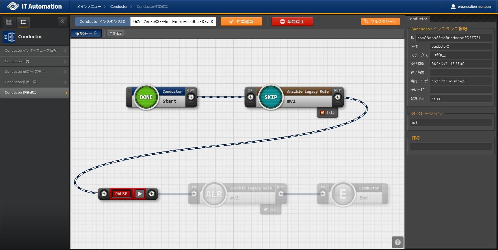

   Conductor実行中/Conductor Pause状態画面
   
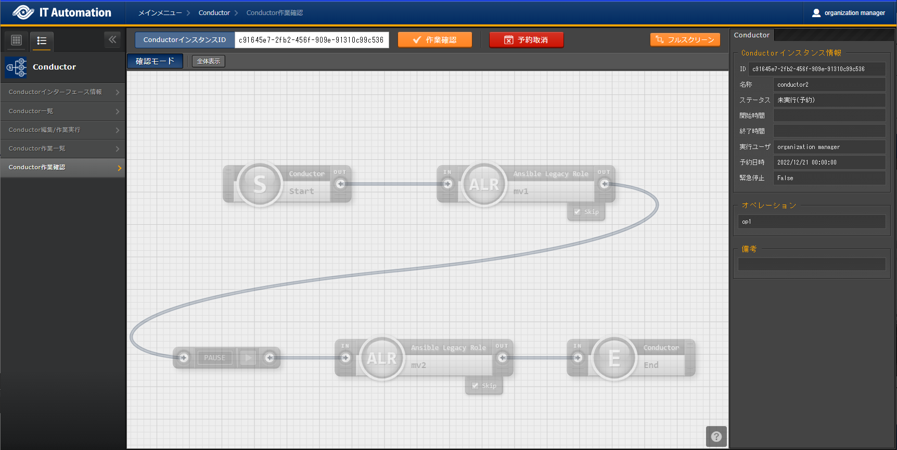

   日時予約されたConductor実行画面(未実行)

* 画面右側上部の領域には、Conductorの詳細情報が表示されます。
* Nodeを選択すると、選択しているNodeの詳細情報が表示されます。

  #. 「Conductor」タブ
  
     * Node未選択の場合表示されます。
     * タブ内の項目は以下の通りです。
  
     .. table:: 「Conductor」タブ
        :align: left
     
        +---------------------------------+------------------------------------------+
        | **項目**                        | **説明**                                 |
        +==================+==============+==========================================+
        | Conductor\       | ID           | Conductorインスタンスに対応した一意のID\ |
        | インスタンス\    |              | が自動採番されます。                     |
        | 情報             +--------------+------------------------------------------+
        |                  | 名称         | 実行中の Conductor クラス名称を\         |
        |                  |              | 表示します。                             |
        |                  +--------------+------------------------------------------+
        |                  | ステータス   | 実行中のConductorのステータスを表示し\   |
        |                  |              | ます。ステータスには以下の状態が\        |
        |                  |              | 存在します。                             |
        |                  |              |                                          |
        |                  |              | ・未実行                                 |
        |                  |              |                                          |
        |                  |              | ・未実行（予約）                         |
        |                  |              |                                          |
        |                  |              | ・実行中                                 |
        |                  |              |                                          |
        |                  |              | ・実行中（遅延）                         |
        |                  |              |                                          |
        |                  |              | ・一時停止                               |
        |                  |              |                                          |
        |                  |              | ・正常終了                               |
        |                  |              |                                          |
        |                  |              | ・緊急停止                               |
        |                  |              |                                          |
        |                  |              | ・異常終了                               |
        |                  |              |                                          |
        |                  |              | ・想定外エラー                           |
        |                  |              |                                          |
        |                  |              | ・予約取消                               |
        |                  +--------------+------------------------------------------+
        |                  | 開始時間     | 実行開始日時を表示します。               |
        |                  +--------------+------------------------------------------+
        |                  | 終了時間     | 実行終了日時を表示します。               |
        |                  +--------------+------------------------------------------+
        |                  | 実行ユーザ   | Conductorを実行したユーザを表示します。  |
        |                  +--------------+------------------------------------------+
        |                  | 予約日時     | 予約中のConductorの実行日時を表示します。|
        |                  +--------------+------------------------------------------+
        |                  | 緊急停止     | 実行中の Conductor が緊急停止された場合\ |
        |                  |              | 「発令済」、それ以外の場合は\            |
        |                  |              | 「未発令」を表示します。                 |
        +------------------+--------------+------------------------------------------+
        | オペレーション                  | オペレーション名を表示します。           |
        +---------------------------------+------------------------------------------+
        | 備考                            | Conductorに対する説明や\                 |
        |                                 | コメントを表示します。                   |
        +---------------------------------+------------------------------------------+
  
  #. 「Node」タブ
  
     *  Nodeを選択した場合表示されます。
     *  タブ内の項目は以下の通りです。
   
     .. table:: 「Node」タブ
        :align: left
     
        +---------------------------------+------------------------------------------+
        | **項目**                        | **説明**                                 |
        +==================+==============+==========================================+
        | Node\            | ID           | Nodeインスタンスに対応した一意のID\      |
        | インスタンス\    |              | が自動採番されます。                     |
        | 情報             +--------------+------------------------------------------+
        |                  | 種別         | Node の種類を表示します。                |
        |                  +--------------+------------------------------------------+
        |                  | Node ID      | **{{#4:こちらに入る説明文の記入をお願い\ |
        |                  |              | 致します}}**                             |
        |                  +--------------+------------------------------------------+
        |                  | ステータス   | 実行中のConductorのステータスを表示し\   |
        |                  |              | ます。ステータスには以下の状態が\        |
        |                  |              | 存在します。                             |
        |                  |              |                                          |
        |                  |              | ・未実行                                 |
        |                  |              |                                          |
        |                  |              | ・準備中                                 |
        |                  |              |                                          |
        |                  |              | ・実行中                                 |
        |                  |              |                                          |
        |                  |              | ・実行中（遅延）                         |
        |                  |              |                                          |
        |                  |              | ・実行完了                               |
        |                  |              |                                          |
        |                  |              | ・異常終了                               |
        |                  |              |                                          |
        |                  |              | ・緊急停止                               |
        |                  |              |                                          |
        |                  |              | ・保留中                                 |
        |                  |              |                                          |
        |                  |              | ・正常終了                               |
        |                  |              |                                          |
        |                  |              | ・準備エラー                             |
        |                  |              |                                          |
        |                  |              | ・想定外エラー                           |
        |                  |              |                                          |
        |                  |              | ・Skip 完了                              |
        |                  |              |                                          |
        |                  |              | ・Skip後保留中                           |
        |                  |              |                                          |
        |                  |              | ・Skip完了                               |
        |                  |              |                                          |
        |                  |              | ・警告終了                               |
        |                  +--------------+------------------------------------------+
        |                  | Stファイル   | Conductorを実行したユーザを表示します。  |
        |                  +--------------+------------------------------------------+
        |                  | 開始日時     | 実行開始日時を表示します。               |
        |                  +--------------+------------------------------------------+
        |                  | 終了日時     | 実行終了日時を表示します。               |
        +------------------+--------------+------------------------------------------+
        | 個別オペレーション              | Movement毎にオペレーションを指定した\    |
        |                                 | 場合は、そのオペレーション名を表示\      |
        |                                 | します。                                 |
        +---------------------------------+------------------------------------------+
        | 備考                            | Nodeに対する説明や\                      |
        |                                 | コメントを表示します。                   |
        +---------------------------------+------------------------------------------+
  

付録
====

Conductor通知先定義
-------------------

Conductor通知先定義設定例
~~~~~~~~~~~~~~~~~~~~~~~~~
.. table:: Teams設定例
   :align: left

   +-----------------------+--------------------------------------------------+
   | 通知名称              | 通知サンプル                                     |
   +=======================+==================================================+
   | 通\                   |  通知先のTeamsのWebhook URLを入力して下さい。    |
   | 知先(CURLOPT_URL)     |                                                  |
   +-----------------------+--------------------------------------------------+
   | ヘッダー              |  [ "Content-Type: application/json" ]            |
   | (CURLOPT_HTTPHEADER)  |                                                  |
   +-----------------------+--------------------------------------------------+
   | メッセージ(C\         | {"text": "通知名：__NOTICE_NAME__,            |
   | URLOPT_POSTFIELDS)    | Conductor名称: \__CONDUCTOR_NAME__,           |
   |                       | Con                                              |
   |                       | ductorインスタンスID:__CONDUCTOR_INSTANCE_ID__,  |
   |                       |   オペレーションID: \__OPERATION_ID__,        |
   |                       |  オペレーション名:__OPERATION_NAME__,         |
   |                       |  ステータスID: \__STATUS_ID__,                |
   |                       |  ステータス: \__STATUS_NAME__,                |
   |                       |  実行ユーザー: \__EXECUTION_USER__,        |
   |                       | 予約日時: \__TIME_BOOK__,  開始日時:          |
   |                       | \__TIME_START__,  終了日時: \__TIME_END__,    |
   |                       |  緊急停止フラグ: \__ABORT_FLAG__,          |
   |                       | 作業URL: \__JUMP_URL__,   "}                  |
   +-----------------------+--------------------------------------------------+
   | PROXY / URL           | http://proxy.co.jp                               |
   | (CURLOPT_PROXY)       |                                                  |
   +-----------------------+--------------------------------------------------+
   | PROXY / PORT          | 8080                                             |
   | (\                    |                                                  |
   | CURLOPT_PROXYPORT)    |                                                  |
   +-----------------------+--------------------------------------------------+
   | 作業確認URL(FQDN)     | http://exastro-it-automation.local               |
   +-----------------------+--------------------------------------------------+
   | その他                |                                                  |
   +-----------------------+--------------------------------------------------+
   | 開始日時              |                                                  |
   +-----------------------+--------------------------------------------------+
   | 終了日時              |                                                  |
   +-----------------------+--------------------------------------------------+
|

.. figure:: ./conductor/image56.png
   :width: 600px
   :alt: Teams通知表示例

   Teams通知表示例

.. table:: Slack設定例
   :align: left
   
   +--------------------+-------------------------------------------------+
   | 通知名称           | 通知サンプル                                    |
   +====================+=================================================+
   | 通\                | 通知先のSlackのWebhook URLを入力して下さい。    |
   | 知先(CURLOPT_URL)  |                                                 |
   +--------------------+-------------------------------------------------+
   | ヘッダー(C\        | [ "Content-Type: application/json" ]            |
   | URLOPT_HTTPHEADER) |                                                 |
   +--------------------+-------------------------------------------------+
   | メッセージ(C\      | {                                               |
   | URLOPT_POSTFIELDS) |                                                 |
   |                    | "username": "ITAConductor実行通知",             |
   |                    |                                                 |
   |                    | "text": "通知名：__NOTICE_NAME__, \\n           |
   |                    | Conductor名称: \__CONDUCTOR_NAME__, \\n         |
   |                    | Con                                             |
   |                    | ductorインスタンスID:__CONDUCTOR_INSTANCE_ID__, |
   |                    | \\n オペレーションID: \__OPERATION_ID__,        |
   |                    | \\nオペレーション名:__OPERATION_NAME__,         |
   |                    | \\nステータスID: \__STATUS_ID__, \\nステータス: |
   |                    | \__STATUS_NAME__, \\n実行ユーザー:              |
   |                    | \__EXECUTION_USER__, \\n 予約日時:              |
   |                    | \__TIME_BOOK__, \\n開始日時: \__TIME_START__,   |
   |                    | \\n終了日時: \__TIME_END__, \\n緊急停止フラグ:  |
   |                    | \__ABORT_FLAG__, \\n 作業URL: \__JUMP_URL_\_ "  |
   |                    |                                                 |
   |                    | }                                               |
   +--------------------+-------------------------------------------------+
   | PROXY / URL        | http://proxy.co.jp                              |
   | (CURLOPT_PROXY)    |                                                 |
   +--------------------+-------------------------------------------------+
   | PROXY / PORT       | 8080                                            |
   | (\                 |                                                 |
   | CURLOPT_PROXYPORT) |                                                 |
   +--------------------+-------------------------------------------------+
   | 作業確認URL(FQDN)  | http://exastro-it-automation.local              |
   +--------------------+-------------------------------------------------+
   | その他             |                                                 |
   +--------------------+-------------------------------------------------+
   | 開始日時           |                                                 |
   +--------------------+-------------------------------------------------+
   | 終了日時           |                                                 |
   +--------------------+-------------------------------------------------+

.. figure:: ./conductor/image57.png
   :width: 600px
   :alt: Slack通知表示例

   Slack通知表示例

.. table:: 設定サンプル(Proxy設定、通知抑止設定、その他設定あり)
   :align: left

   +--------------------+-------------------------------------------------+
   | 通知名称           | 通知サンプル                                    |
   +====================+=================================================+
   | 通\                | https://sample.webhook.xxx.com/yyyyyyyy         |
   | 知先(CURLOPT_URL)  |                                                 |
   +--------------------+-------------------------------------------------+
   | ヘッダー(C\        | [ "Content-Type: application/json" ]            |
   | URLOPT_HTTPHEADER) |                                                 |
   +--------------------+-------------------------------------------------+
   | メッセージ(C\      | {"text": "通知内容"}                            |
   | URLOPT_POSTFIELDS) |                                                 |
   +--------------------+-------------------------------------------------+
   | PROXY / URL        | http://proxy.co.jp                              |
   | (CURLOPT_PROXY)    |                                                 |
   +--------------------+-------------------------------------------------+
   | PROXY / PORT       | 8080                                            |
   | (\                 |                                                 |
   | CURLOPT_PROXYPORT) |                                                 |
   +--------------------+-------------------------------------------------+
   | 作業確認URL(FQDN)  | http://exastro-it-automation.local              |
   +--------------------+-------------------------------------------------+
   | その他             | {"CURLOPT_TIMEOUT":"10"}                        |
   +--------------------+-------------------------------------------------+
   | 開始日時           | 2020/01/01 00:00:00                             |
   +--------------------+-------------------------------------------------+
   | 終了日時           | 2020/01/01 00:00:00                             |
   +--------------------+-------------------------------------------------+
   | 備考               | 自由記述欄です                                  |
   +--------------------+-------------------------------------------------+

.. _conductor_notification_log:
通知ログ出力例
~~~~~~~~~~~~~~

通知ログの構造
**************

.. code-block:: 

   YYYY-MM-dd HH:ii:ss 通知実行結果(<ID:通知名称>,<ID:ステータス名称>) 
                                                                       
   Array                                                               
                                                                       
   (                                                                   
                                                                       
   [RETURN_MSG] =>　 ：通知実行時の返り値                              
                                                                       
   [OPTION] => Array 　　　　　　　　　　　 ：通知実行時のオプション   
                                                                       
   (                                                                   
                                                                       
   [CURLOPT_XXXXXXXX] =>                                               
                                                                       
   ・・・・・・・・略・・・・・・・・                                  
                                                                       
   )                                                                   
                                                                       
   [RESSULT] => Array ：通知実行結果                                   
                                                                       
   (                                                                   
                                                                       
   [url] => ：通知先URL                                                
                                                                       
   [http_code] => 　：HTTPステータスコード                             
                                                                       
   ・・・・・・・・略・・・・・・・・                                  
                                                                       
   )                                                                   
                                                                       
   )                                                                 

例) 通知実行ログ(正常)
^^^^^^^^^^^^^^^^^^^^^^
.. code-block:: 

   2021-11-05 15:10:22 通知実行結果(2:通知サンプル,5:正常終了)           
                                                                         
   Array                                                                 
                                                                         
   (                                                                     
                                                                         
   [RETURN_MSG] => 1                                                     
                                                                         
   [OPTION] => Array                                                     
                                                                         
   (                                                                     
                                                                         
   [CURLOPT_CUSTOMREQUEST] => POST                                       
                                                                         
   [CURLOPT_HEADER] =>                                                   
                                                                         
   [CURLOPT_SSL_VERIFYPEER] =>                                           
                                                                         
   [CURLOPT_SSL_VERIFYHOST] => 0                                         
                                                                         
   [CURLOPT_TIMEOUT] => 5                                                
                                                                         
   [CURLOPT_CONNECTTIMEOUT] => 2                                         
                                                                         
   [CURLOPT_RETURNTRANSFER] => 1                                         
                                                                         
   [CURLOPT_HTTPPROXYTUNNEL] => 1                                        
                                                                         
   [CURLOPT_URL] => https://sample.webhook.xxx.com/yyyyyyyy              
                                                                         
   [CURLOPT_HTTPHEADER] => Array                                         
                                                                         
   (                                                                     
                                                                         
   [0] => Content-Type: application/json                                 
                                                                         
   )                                                                     
                                                                         
   [CURLOPT_POSTFIELDS] => {"text": "通知名：通知サンプル2,           
   Conductor名称: NULL,   ConductorインスタンスID:3,               
   オペレーションID: 1,  オペレーション名:OP_NULL,  ステータスID:  
   5,  ステータス: 正常終了,  実行ユーザー: システム管理者,     
   予約日時: ,  開始日時: 2021/11/05 15:10:08,  終了日時:          
   2021/11/05 15:10:18,  緊急停止フラグ: 未発令,   作業URL:        
   http://exastro-it-automation.lo                                       
   cal/default/menu/01_browse.php?no=2100180005&conductor_instance_id=3, 
     "}                                                               
                                                                         
   [CURLOPT_PROXY] => https://sample.proxy.xxx.com                       
                                                                         
   [CURLOPT_PROXYPORT] => 8080                                           
                                                                         
   )                                                                     
                                                                         
   [RESSULT] => Array                                                    
                                                                         
   (                                                                     
                                                                         
   [url] => https://sample.webhook.xxx.com/yyyyyyyy                      
                                                                         
   [content_type] => text/plain; charset=utf-8                           
                                                                         
   [http_code] => 200                                                    
                                                                         
   [header_size] => 834                                                  
                                                                         
   [request_size] => 1005                                                
                                                                         
   [filetime] => -1                                                      
                                                                         
   [ssl_verify_result] => 0                                              
                                                                         
   [redirect_count] => 0                                                 
                                                                         
   [total_time] => 1.519411                                              
                                                                         
   [namelookup_time] => 0.083714                                         
                                                                         
   [connect_time] => 0.107712                                            
                                                                         
   [pretransfer_time] => 0.44203                                         
                                                                         
   [size_upload] => 560                                                  
                                                                         
   [size_download] => 1                                                  
                                                                         
   [speed_download] => 0                                                 
                                                                         
   [speed_upload] => 368                                                 
                                                                         
   [download_content_length] => 1                                        
                                                                         
   [upload_content_length] => 560                                        
                                                                         
   [starttransfer_time] => 1.519364                                      
                                                                         
   [redirect_time] => 0                                                  
                                                                         
   [redirect_url] =>                                                     
                                                                         
   [primary_ip] => XXX.XXX.XXX.XXX                                       
                                                                         
   [certinfo] => Array                                                   
                                                                         
   (                                                                     
                                                                         
   )                                                                     
                                                                         
   [primary_port] => 8080                                                
                                                                         
   [local_ip] => XXX.XXX.XXX.XXX                                         
                                                                         
   [local_port] => 39874                                                 
                                                                         
   )                                                                     
                                                                         
   )

例) 通知実行ログ(異常)
^^^^^^^^^^^^^^^^^^^^^^

.. code-block:: 

   2021-11-05 15:10:20 通知実行結果(1:通知サンプル,5:正常終了)           
                                                                         
   Array                                                                 
                                                                         
   (                                                                     
                                                                         
   [RETURN_MSG] =>                                                       
                                                                         
   [OPTION] => Array                                                     
                                                                         
   (                                                                     
                                                                         
   [CURLOPT_CUSTOMREQUEST] => POST                                       
                                                                         
   [CURLOPT_HEADER] =>                                                   
                                                                         
   [CURLOPT_SSL_VERIFYPEER] =>                                           
                                                                         
   [CURLOPT_SSL_VERIFYHOST] => 0                                         
                                                                         
   [CURLOPT_TIMEOUT] => 5                                                
                                                                         
   [CURLOPT_CONNECTTIMEOUT] => 2                                         
                                                                         
   [CURLOPT_RETURNTRANSFER] => 1                                         
                                                                         
   [CURLOPT_HTTPPROXYTUNNEL] => 1                                        
                                                                         
   [CURLOPT_URL] => https://sample.webhook.xxx.com/yyyyyyyy              
                                                                         
   [CURLOPT_HTTPHEADER] => Array                                         
                                                                         
   (                                                                     
                                                                         
   [0] => Content-Type: application/json                                 
                                                                         
   )                                                                     
                                                                         
   [CURLOPT_POSTFIELDS] => {"text": "通知名：通知サンプル,            
   Conductor名称: NULL,   ConductorインスタンスID:3,               
   オペレーションID: 1,  オペレーション名:OP_NULL,  ステータスID:  
   5,  ステータス: 正常終了,  実行ユーザー: システム管理者,     
   予約日時: ,  開始日時: 2021/11/05 15:10:08,  終了日時:          
   2021/11/05 15:10:18,  緊急停止フラグ: 未発令,   作業URL:        
   http://exastro-it-automation.lo                                       
   cal/default/menu/01_browse.php?no=2100180005&conductor_instance_id=3, 
     "}                                                               
                                                                         
   [CURLOPT_PROXY] =>                                                    
                                                                         
   [CURLOPT_PROXYPORT] =>                                                
                                                                         
   )                                                                     
                                                                         
   [RESSULT] => Array                                                    
                                                                         
   (                                                                     
                                                                         
   [url] => https://sample.webhook.xxx.com/yyyyyyyy                      
                                                                         
   [content_type] =>                                                     
                                                                         
   [http_code] => 0                                                      
                                                                         
   [header_size] => 0                                                    
                                                                         
   [request_size] => 0                                                   
                                                                         
   [filetime] => -1                                                      
                                                                         
   [ssl_verify_result] => 0                                              
                                                                         
   [redirect_count] => 0                                                 
                                                                         
   [total_time] => 2.011686                                              
                                                                         
   [namelookup_time] => 0.532318                                         
                                                                         
   [connect_time] => 0                                                   
                                                                         
   [pretransfer_time] => 0                                               
                                                                         
   [size_upload] => 0                                                    
                                                                         
   [size_download] => 0                                                  
                                                                         
   [speed_download] => 0                                                 
                                                                         
   [speed_upload] => 0                                                   
                                                                         
   [download_content_length] => -1                                       
                                                                         
   [upload_content_length] => -1                                         
                                                                         
   [starttransfer_time] => 0                                             
                                                                         
   [redirect_time] => 0                                                  
                                                                         
   [redirect_url] =>                                                     
                                                                         
   [primary_ip] => XXX.XXX.XXX.XXX                                       
                                                                         
   [certinfo] => Array                                                   
                                                                         
   (                                                                     
                                                                         
   )                                                                     
                                                                         
   [primary_port] => 443                                                 
                                                                         
   [local_ip] =>                                                         
                                                                         
   [local_port] => 0                                                     
                                                                         
   )                                                                     
                                                                         
   )                                                                     

.. |image2| image:: ./conductor/image8.png
   :width: 1.1811in
   :height: 0.4086in
.. |image3| image:: ./conductor/image9.png
   :width: 1.1811in
   :height: 0.31287in

.. |image7| image:: ./conductor/image13.png
   :width: 1.1811in
   :height: 0.9765in
.. |image8| image:: ./conductor/image14.png
   :width: 1.1811in
   :height: 0.67667in
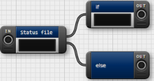

.. |image11| image:: ./conductor/image37.png
   :width: 0.3937in
   :height: 0.3937in
.. |image12| image:: ./conductor/image38.png
   :width: 0.3937in
   :height: 0.43032in
.. |image13| image:: ./conductor/image39.png
   :width: 0.3937in
   :height: 0.41045in

.. |image16| image:: ./conductor/image42.png
   :width: 0.3937in
   :height: 0.40276in
.. |image17| image:: ./conductor/image43.png
   :width: 0.37391in
   :height: 0.39758in

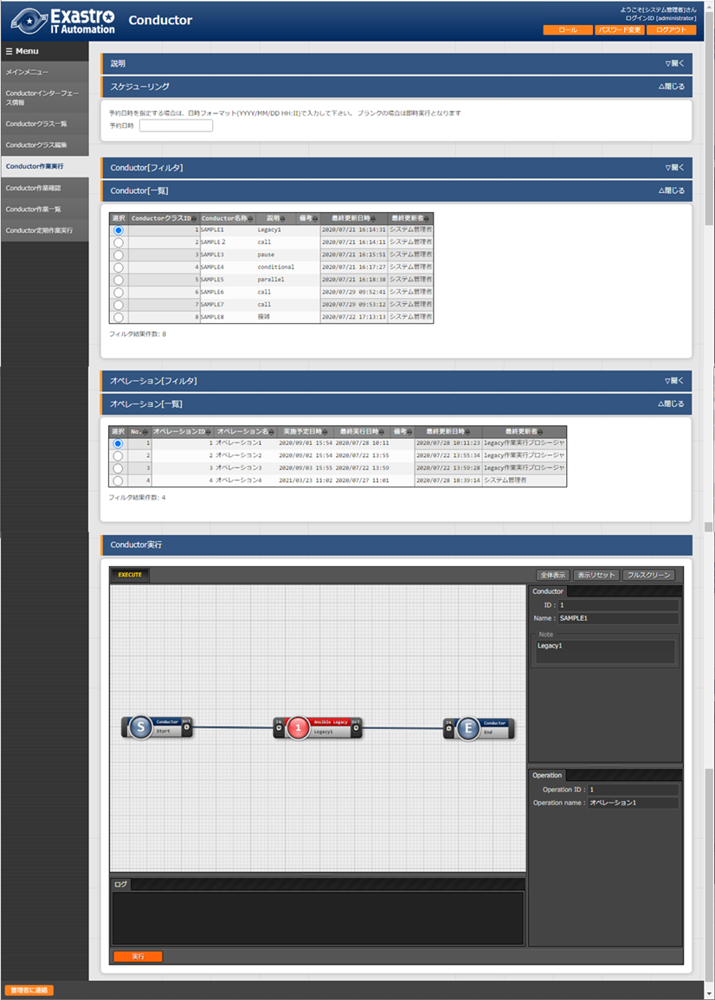

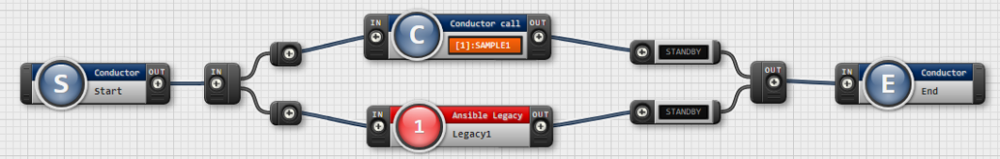