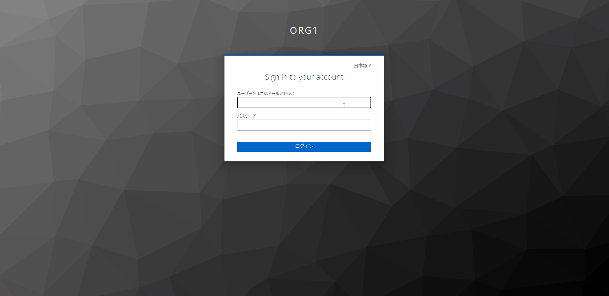
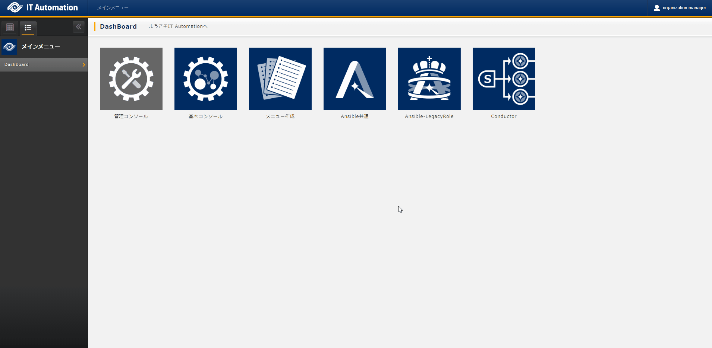
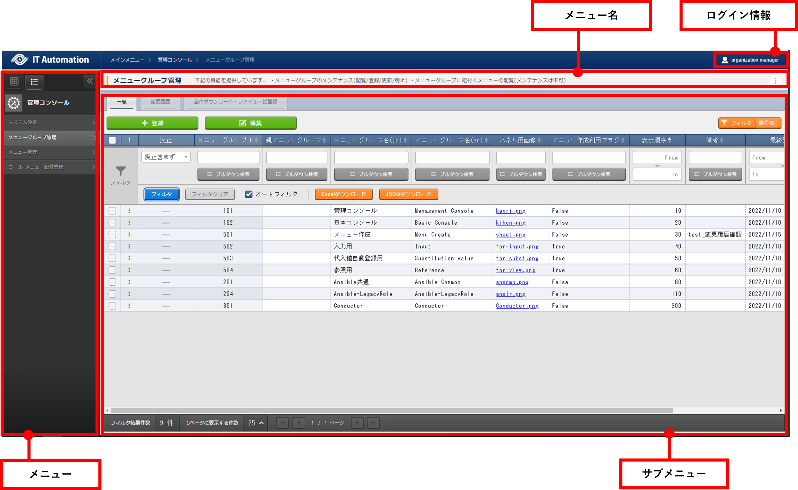
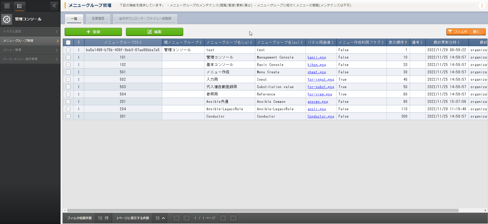
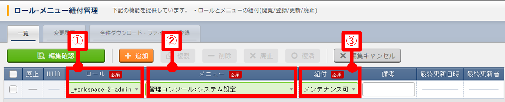

==============
管理コンソール
==============

はじめに
========

| 本書は、ITAシステムの管理コンソールの概要および操作方法について記載したものです。

ITAシステム　管理コンソールの概要
=================================
| 本章ではITAを操作するための管理コンソールについて説明します。

ITA管理コンソールについて
-------------------------
| ITA管理コンソールでは、初期メニュー以外に、利用部門が独自の情報をITAのデータベース上で管理する場合、管理レベルにあった個別メニューの作成が出来ます。
| 個別メニューの登録／変更／削除をご使用される際は、製品サポートへお問い合わせ下さい。

.. table:: Webコンテンツメニュー/画面一覧
   :align: left

   +----------+------------------------+-----------------------------+
   | **No.**  | **メニューグループ**   |  **メニュー・画面**         |
   |          |                        |                             |
   +==========+========================+=============================+
   | 1        | 共通部                 | ログイン画面                |
   +----------+                        +-----------------------------+
   | 2        |                        | ワークスペース切替          |
   +----------+                        +-----------------------------+
   | 3        |                        | ロール一覧　                |
   +----------+                        +-----------------------------+
   | 5        |                        | バージョン確認              |
   +----------+------------------------+-----------------------------+
   | 4        | ITA管理コンソール      | メインメニュー              |
   +----------+                        +-----------------------------+
   | 5        |                        | システム設定                |
   +----------+                        +-----------------------------+
   | 6        |                        | メニューグループ管理        |
   +----------+                        +-----------------------------+
   | 7        |                        | メニュー管理                |
   +----------+                        +-----------------------------+
   | 8        |                        | ロール・メニュー紐付管理    |
   +----------+------------------------+-----------------------------+

画面説明 ログイン画面、ログイン情報
~~~~~~~~~~~~~~~~~~~~~~~~~~~~~~~~~~~~~~~~~~~~~~~~~~~~~~~~~~~~~

ログイン
********
| **{{#1:インストール後の「ログインID」と「パスワード」は固定ではない認識で合っているでしょうか。}}**
| ITAシステムのメニュー画面に未ログインでアクセスした場合、「ログイン画面」が表示されます。
| ユーザー登録後に初めてログインした際は「パスワード変更画面」に遷移します。

ワークスペース切替
******************
| 各メニュー右上のユーザー名表示部分をクリックすると、ユーザーがアクセスできるワークスペースを確認することが可能です。
| ワークスペース名をクリックすると選択したワークスペースのメインメニュー画面へ遷移します。

ロール一覧
**********
| 各メニュー右上のユーザー名表示部分をクリックすると、自分がどのロールに所属しているかを確認することが可能です。

バージョン確認
**********
| 各メニュー右上のユーザー名表示部分をクリックし、 \ :guilabel:`バージョン確認`\  をクリックするとインストールされているITAのバージョンとドライバを確認することが可能です。

ログアウト
**********
| 各メニュー右上のユーザー名表示部分をクリックし、 \ :guilabel:`ログアウト`\  をクリックするとシステムからログアウトします。
| ログアウト後はログイン画面に遷移します。

画面説明 メインメニュー
~~~~~~~~~~~~~~~~~~~~~~~

| メインメニューにはDashBoardが表示されます。

画面構成
********

| 各メニューグループのパネルが表示されます。
| パネルをクリックすることで指定のメニューグループのメインメニューへ遷移出来ます。
| インストールしたドライバのみが表示されます。

画面説明 基本画面構成
~~~~~~~~~~~~~~~~~~~~~

| ITAシステムが提供する各メニュー画面は基本的に同じ要素で構成されています。
| その構成要素は次の通りです。

   画面構成

.. table:: 画面構成一覧
   :align: Left

   +---------+------------+------------------------------------------------------+
   | **No.** | **画面名** | **説明**                                             |
   |         |            |                                                      |
   +=========+============+======================================================+
   | 1       | メニュー名 | 現在表示しているメニュー名が表示されます。           |
   +---------+------------+------------------------------------------------------+
   | 2       | メニュー   | 操作/表示可能なメニューグループが\                   |
   |         |            | リストとして表示されます。\                          |
   |         |            | また、現在のメニューグループで、\                    |
   |         |            | 操作/表示可能なメニューがリストとして表示されます。\ |
   +---------+------------+------------------------------------------------------+
   | 3       | サブ\      | 各メニューに対応する登録、設定などを行う部分です。\  |
   |         | メニュー   | ※詳細は後述します。                                  |
   +---------+------------+------------------------------------------------------+
   | 4       | ログイン\  | 現在ログインしているアカウント名が表示されます。     |
   |         | 情報       | クリックすると、ワークスペースの切替処理や\          |
   |         |            | 所属しているロールの確認、インストールされている\    |
   |         |            | ITAとドライバのバージョン確認\                       |
   |         |            | 、ログアウト処理操作が可能です。                     |
   +---------+------------+------------------------------------------------------+

| 各メニュー操作部の構成要素に対する操作方法を説明します。

一覧タブ
********
| 登録されている項目の確認や登録/更新/廃止/復活を行うことが出来ます。

- | **登録**
  | 各メニューに対して、新規に項目を登録します。
  | 登録内容は各メニューによって異なりますので、各利用手順マニュアルを参照して下さい。
  | エクセル形式、JSON形式のファイルを使用する一括登録については「\ :ref:`management_console_download_all_and_edit_file_uploads`\ 」をご確認下さい。

  .. figure:: ./management_console/登録操作.gif
     :alt: メインメニュー
     :width: 800px
     :align: center

  #. 「一覧」タブ内上部の \ :guilabel:`登録`\  をクリックして登録/編集画面に遷移します。
  #. 必要な情報を入力し、「一覧」タブ内上部の \ :guilabel:`編集確認`\  をクリックすると編集確認画面が表示されます。
  #. \ :guilabel:`編集反映`\  をクリックして更新します。

  .. note:: | **登録時のボタンについて**
              - | \ :guilabel:`追加`\
                | 新規登録用のレコードが追加されます。
                | 複数件を同時に登録したい場合に使用します。
              - | \ :guilabel:`複製`\
                | チェックを付けたレコードが複製されます。
                | 手順については「\ :ref:`複製<duplicate>`\ 」をご確認下さい。
              - | \ :guilabel:`削除`\
                | チェックを付けたレコードが削除されます。

  .. note:: | **プルダウンによる入力項目について**
            | 登録/更新時の入力項目で、プルダウンによる選択が可能な項目は、以下の仕様となっています。

            .. figure:: ./management_console/プルダウンによる入力項目.gif
               :alt:  プルダウンによる入力項目
               :align: center
               :width: 6in

            #. | 検索窓が表示されます。
               | 検索したい語句を入力することにより、選択項目を絞り込むことが出来ます。
               | 部分一致検索で、大文字と小文字、全角と半角は補正検索されます。
            #. | 選択項目が表示されます。

- | **表示フィルタ**
  | 各メニューで登録されている項目を表示するための検索条件を指定します。
  | 検索条件、検索項目はメニューごとに異なります。ここでは共通機能について説明します。
  | 「一覧」タブ内右上の \ :guilabel:`フィルタ|開く/閉じる`\  をクリックすることで表示／非表示の切替が可能です。

  .. figure:: ./management_console/表示フィルタ画面.gif
     :alt: 表示フィルタ画面
     :align: center
     :width: 800px

  #. | 廃止カラム
     | 初期状態では、「廃止含まず」がセットされています。
     | 他に「全レコード」、「廃止のみ」が任意操作で選択可能であり、希望表示方法を指定します。
     | **必ずいずれかの選択が必須**\ です。
  #. | 検索条件
     | 検索する条件を指定します。
     | システム名や備考などにおいて、文字指定が出来る項目については「あいまい検索」or「プルダウン検索」でフィルタすることが出来ます。
  #. | オートフィルタ
     | オートフィルタをチェックしておくと、フィルタ条件を選択するごとに条件に合った一覧を自動で表示します。
     | 画面表示時のチェック有無は、管理コンソール「メニュー管理」の「オートフィルタチェック」で設定可能です。
  #. | カラム説明 (Description)
     | カーソルを合わせると該当する列の説明文がポップアップ表示されます。
  #. | フィルタ
     | 検索条件を手入力およびプルダウンメニューから選択し、Enterキーまたは\ :guilabel:`フィルタ`\ をクリックすると登録情報が表示されます。
  #. | Excelダウンロード
     | 検索条件に一致した項目の一覧をエクセル形式でダウンロード出来ます。
  #. | JSONダウンロード
     | 検索条件に一致した項目の一覧をJSON形式でダウンロード出来ます。

  .. note:: | 表示フィルタからダウンロードしたExcel形式ファイルとJSON形式ファイルは「\ :ref:`全件ダウンロード・ファイル一括登録<management_console_download_all_and_edit_file_uploads>`\ 」で使用することが出来ます。

- | **編集**
  | 登録されている項目の更新を行います。
  | 編集内容は各メニューによって異なりますので、各利用手順マニュアルを参照して下さい。

  .. figure:: ./management_console/編集操作.gif
     :alt: 編集の操作
     :align: center
     :width: 800px

  #. | 対象項目の \ :guilabel:`…`\  > \ :guilabel:`編集`\  を順にクリックして登録/編集画面に遷移します。
     | もしくは、対象項目にチェックを入れ、「一覧」タブ内上部の \ :guilabel:`編集`\  をクリックします。
     | チェックを入れずに「一覧」タブ内上部の \ :guilabel:`編集`\  をクリックすると表示されているすべての項目が編集対象となります。
  #. | 更新する情報を入力し、「一覧」タブ内上部の \ :guilabel:`編集確認`\  をクリックすると編集確認画面が表示されます。
  #. | \ :guilabel:`編集反映`\  をクリックして更新します。

  .. note:: | **編集時のボタンについて**
              - | \ :guilabel:`追加`\
                | 新規登録用のレコードが追加されます。
                | 複数件を同時に登録したい場合に使用します。
              - | \ :guilabel:`複製`\
                | チェックを付けたレコードが複製されます。
                | 手順については「\ :ref:`複製<duplicate>`\ 」をご確認下さい。
              - | \ :guilabel:`削除`\
                | チェックを付けたレコードが削除されます。
              - | \ :guilabel:`廃止`\
                | チェックを付けたレコードの廃止フラグがTrueになります。
                | 更新後に廃止となります。

.. _Duplicate:
- | **複製**
  | 登録されている項目の情報を転用して登録することが可能です。

  #. | 対象項目の \ :guilabel:`…`\  > \ :guilabel:`複製`\  を順にクリックして登録/編集画面に遷移します。
     | もしくは、対象項目にチェックを入れ、「一覧」タブ内上部の \ :guilabel:`編集`\  をクリックします。
     | 登録/編集画面に遷移したら \ :guilabel:`複製`\  をクリックします。
  #. | 対象項目の値を反映した状態の新規登録用レコードが表示されます。

  .. figure:: ./management_console/複製操作.gif
     :alt: 編集の操作
     :align: center
     :width: 800px

  | **{{#2:sensitive設定について、下記の「Ansible-LegacyRole」の代入値管理メニューのほかにsensitive設定が登録編集出来るメニューはあるでしょうか。}}**

  .. warning:: - | 対象項目がパスワード項目の場合、複製処理は行われません。
               - | Ansible-LegacyRoleメニューグループ＞代入値管理メニューのように、Sensitive設定が存在する項目に関しては、Sensitive設定が「OFF」の場合のみ複製処理を行います。

変更履歴タブ
************
| 各メニューで、登録した項目の変更履歴を表示することが出来ます。

- | **変更履歴の確認**
  #. | 各メニューの主キーを指定することで、対応する項目の変更履歴を表示することが出来ます。
     | もしくは、「一覧」タブの対象項目の \ :guilabel:`…`\  > \ :guilabel:`履歴`\  を順にクリックすると変更履歴を表示することが出来ます。
  #. | 変更実施日時が新しい順に一覧表示され、前回との変更箇所がオレンジ色太文字で表示されます。

  .. figure:: ./management_console/変更履歴操作.gif
     :alt: 変更履歴の操作
     :width: 800px
     :align: center

- | **プルダウン選択を含んだ場合の変更履歴について**
  | 「プルダウン選択」の参照元を変更した場合、参照側の値も自動的に変更されます。
  | 「変更履歴」は、値を編集（登録/更新/廃止/復活）した時点の値が表示されます。
  | 以下、例を用いて説明します。

  | 例：パラメータシート「ぱらむ001」の項目「ぱらむB」が「マスタ001」の項目「マスタ」を参照している場合

  #. | 事前準備として、メニュー作成メニューグループ>メニュー定義・作成メニューで以下のデータシートとパラメータシートを作成します。
     - | データシート「マスタ001」

       .. figure:: ./management_console/データシート「マスタ001」.png
          :alt: 「メニュー定義・作成」メニューで作成したデータシート
          :align: center
          :width: 6in

          「メニュー定義・作成」メニューで作成したデータシート

     - | パラメータシート「ぱらむ001」

       .. figure:: ./management_console/パラメータシート「ぱらむ001」.png
          :alt: 「メニュー定義・作成」メニューで作成したパラメータシート
          :align: center
          :width: 6in

          「メニュー定義・作成」メニューで作成したパラメータシート

  #. | 入力用メニューグループ>マスタ001メニューからパラメータ「マスタ」に値「mas1-1」を登録します。
  #. | 入力用メニューグループ>ぱらむ001メニューから1件登録します。
  #. | 入力用メニューグループ>マスタ001メニューからパラメータ「マスタ」の値を編集し「mas1-2」で更新を行います。
  #. | 入力用メニューグループ>マスタ001メニューからパラメータ「マスタ」の値を編集し「mas1-3」で更新を行います。
  #. | 入力用メニューグループ>ぱらむ001メニューから先ほど登録した対象の「ぱらむA」を編集し、更新を行います。

     .. figure:: ./management_console/プルダウン選択を含んだ変更履歴の操作.gif
        :alt: プルダウン選択を含んだ変更履歴の操作
        :align: center
        :width: 800px

  #. | 入力用メニューグループ>マスタ001メニューからパラメータ「マスタ」の値を編集し「mas1-4」で更新を行います。
  #. | 入力用メニューグループ>マスタ001メニューからパラメータ「マスタ」の値を編集し「mas1-5」で更新を行います。
  #. | 入力用メニューグループ>ぱらむ001メニューから先ほど登録した対象の「ぱらむA」を編集し、更新を行います。

  #. | 以下のような結果になります。

  .. figure:: ./management_console/マスタ001変更履歴.png
     :alt:  データシート「マスタ001」の変更履歴
     :align: center
     :width: 5in

     データシート「マスタ001」の変更履歴

  .. figure:: ./management_console/ぱらむ001変更履歴.png
     :alt:  パラメータシート「ぱらむ001」の変更履歴
     :align: center
     :width: 5in

     パラメータシート「ぱらむ001」の変更履歴

.. _management_console_download_all_and_edit_file_uploads:
全件ダウンロード・ファイル一括登録
**********************************
| 各メニュー画面に登録されている情報を一括してエクセル形式またはJSON形式でダウンロードすることが出来ます。
| また、同じ形式のファイルで、一括して情報を登録することが出来ます。

- | **ファイルによる一括登録/更新**
  #. | 目的に合ったファイルをダウンロードします。
     - | 登録されている情報の更新/廃止/復活を行う場合は \ :guilabel:`全ダウンロード(Excel)`\  または \ :guilabel:`全ダウンロード(JSON)`\  をクリックし、ファイルをダウンロードして下さい。
     - | 新規に登録を行う場合は \ :guilabel:`新規登録用ダウンロード(Excel)`\  をクリックしてファイルをダウンロードして下さい。
  #. | ダウンロードしたファイルを編集し、保存して下さい。
     | 編集内容は各メニューによって異なりますので、各利用手順マニュアルを参照して下さい。
  #. | 作成したファイル形式に合った \ :guilabel:`ファイル一括登録`\  をクリックし、対象のファイルを選択して \ :guilabel:`一括登録開始`\  をクリックして下さい。

  .. warning:: |  \ :guilabel:`変更履歴全件ダウンロード(Excel)`\  からダウンロードできるファイルは一括登録に使用することが出来ません。

画面説明 メニューの操作方法
~~~~~~~~~~~~~~~~~~~~~~~~~~~

システム設定
************
| ITAシステム導入・運用時に設定すべき各種情報の更新を行います。

- | **【システム設定変更方法】**
  #. | 「一覧」タブの変更したい項目の \ :guilabel:`…`\  > \ :guilabel:`編集`\  を順にクリックして登録/編集画面に遷移します。
     | もしくは、変更したい項目にチェックを入れ、「一覧」タブ内上部の、 \ :guilabel:`編集`\  をクリックして登録/編集画面に遷移します。
  #. | 「設定値」に変更したい値を入力し、 \ :guilabel:`編集確認`\  をクリックします。

     .. danger:: | 「識別ID」は変更しないで下さい。ITAの動作が保証されません。

     - | アップロード禁止拡張子
       | ファイルアップロードを禁止する拡張子を設定することが出来ます。

     .. warning:: - | 拡張子は半角セミコロン区切りで入力して下さい。
                  - | アップロード禁止拡張子の許可を増やすと、セキュリティホールになる可能性があります。
  #. | \ :guilabel:`編集反映`\  をクリックして更新します。

メニューグループ管理
********************
| メニュー（子）はメニューグループ（親）に属します。この画面で親となるメニューグループの登録／更新／廃止を行います。
| メニューグループ名称は、\ **一意**\ である必要があります。
| ここで、各サブメニューの操作について説明します。操作は、他のメニューにおいても共通です。

.. warning:: | データ更新系の操作のため、システム管理者でログインして下さい。

- | **【登録内容の更新／廃止 － 1件ずつ更新／廃止／復活】**
  | メニューグループを1件1件更新／廃止／復活する場合の操作です。

  #. | 「表示フィルタ」に検索条件を入力し、Enterキーか \ :guilabel:`フィルタ`\  をクリックします。
  #. | 対象項目の \ :guilabel:`…`\  ＞ \ :guilabel:`編集`\  を順にクリックして登録/編集画面に遷移します。
     | もしくは、対象項目にチェックを入れ、「一覧」タブ内上部の \ :guilabel:`編集`\  をクリックして登録/編集画面に遷移します。
  #. | 目的に合わせて項目を編集します。
     - | 登録内容を変更する 　　　　　　ー 設定値を変更します。
     - | 項目を無効にする 　　　　　　　ー 対象項目にチェックを入れ、 \ :guilabel:`廃止`\  をクリックします。
     - | 無効（廃止）の項目を有効にする ー 対象項目にチェックを入れ、 \ :guilabel:`復活`\  をクリックします。
  #. | \ :guilabel:`編集確認`\  をクリックすると確認のポップアップ画面が表示されます。
  #. | \ :guilabel:`編集反映`\  をクリックして更新します。

- | **【追加登録 – 1件ずつ登録】**
  | メニューグループを1件1件登録する場合の操作です。

  #. | 「一覧」タブ内上部の \ :guilabel:`登録`\  をクリックして登録/編集画面に遷移します。
  #. | 「メニューグループ名(ja/en)」「メニュー作成利用フラグ」「表示順序」を入力します。
  #. | \ :guilabel:`編集確認`\  をクリックすると確認のポップアップ画面が表示されます。
  #. | \ :guilabel:`編集反映`\  をクリックして更新します。

  .. warning:: - | メニューグループ名称は重複登録出来ません。
               - | 「表示順序」の昇順にメインメニューに表示されます。「表示順序」が同じ場合は、「メニューグループID」の昇順で表示されます。

  .. note:: | 「備考」は任意です。

| **{{#7:【登録内容の更新／廃止– まとめて更新／廃止】【追加登録 – まとめて登録】のJSONファイルを使う場合についてご教示いただけないでしょうか。}}**
- | **【登録内容の更新／廃止– まとめて更新／廃止】**
  | ファイルアップロードでメニューグループを登録する場合の操作です。
  | **エクセル形式**\ と\ **JSON形式**\ のファイルに対応しています。

  #. | 「全件ダウンロード・ファイル一括登録」タブを開き、 \ :guilabel:`全件ダウンロード`\  をクリックして登録用シートをダウンロードします。
  #. | 以下の各項目を入力してファイルを保存します。
     .. table::
        :align: Left

        +---------------+----------------------------+
        | **項目名**    | **入力内容**               |
        +===============+============================+
        | 実行処理種別  | 「登録／更新／廃止／復活\  |
        |               | 」のいずれか               |
        +---------------+----------------------------+
        |メニュー\      | 変更後の名称               |
        |グループ名(ja) |                            |
        +---------------+----------------------------+
        |メニュー\      | 変更後の名称               |
        |グループ名(en) |                            |
        +---------------+----------------------------+
        |表示順序       | 変更後の内容               |
        +---------------+----------------------------+
        |備考           | 変更後の内容               |
        +---------------+----------------------------+

  #. | \ :guilabel:`ファイル一括登録`\  をクリックし、作成したファイルを選択します。
  #. | \ :guilabel:`一括登録開始`\  をクリックしてアップロードを行います。

  .. warning:: | 「実行処理種別」が未選択および正しい処理種別を選択していない場合、登録が実行されません。

- | **【追加登録 – まとめて登録】**
  | ファイルアップロードでメニューグループを登録する場合の操作です。
  | **エクセル形式**\ と\ **JSON形式**\ のファイルに対応しています。

  #. | 「全件ダウンロード・ファイル一括登録」タブを開き、 \ :guilabel:`新規登録用ダウンロード(Excel)`\  をクリックして新規登録用シートをダウンロードします。
  #. | 以下の各項目を入力してファイルを保存します。
     .. table::
        :align: Left

        +---------------+-------------------------+
        | **項目名**    | **入力内容**            |
        +===============+=========================+
        | 実行処理種別  | 登録                    |
        +---------------+-------------------------+
        |メニュー\      | 新規に登録する日本語の\ |
        |グループ名(ja) | メニューグループ名      |
        +---------------+-------------------------+
        |メニュー\      | 新規に登録する英語の\   |
        |グループ名(en) | メニューグループ名      |
        +---------------+-------------------------+
        |表示順序       | 変更後の内容            |
        +---------------+-------------------------+

  #. | \ :guilabel:`ファイル一括登録`\  をクリックし、作成したファイルを選択します。
  #. | \ :guilabel:`一括登録開始`\  をクリックしてアップロードを行います。

| **{{#3:下記「warning」の内容について、「メニューグループの登録を行うと...」という内容は正しいでしょうか。}}**

.. warning:: -  | 「実行処理種別」を「登録」\ **以外**\ にすると、\ **登録が実行されません**\ 。
             -  | メニューグループの登録を行うと、作成したメニューグループ配下に自動的に「メインメニュー」 が登録されて、「システム管理者」ロールのユーザーで参照することが可能となります。
                | 具体的には、以下のメニューに自動的にデータが登録されます。
                - 「メニュー管理」メニュー
                - 「ロール・メニュー紐付管理」メニュー

- | **【パネル用画像】**
  | 登録/編集画面で「パネル用画像」を設定することが出来ます。

  .. warning:: | 「パネル用画像」に使用出来るのは\ **PNGファイルのみ**\ です。
               | 「パネル画像エディタ」機能で編集・保存が可能な独自拡張子「IPF」ファイルは使用することが出来ません。

  | **{{#4:パネル画像エディタ機能は実装されていない認識で合っているでしょうか。}}**

  | 「パネル画像エディタ」サブメニューでパネル用画像を作成することが出来ます。
  .. figure:: ./management_console/image63.png
     :alt:  パネル画像エディタ画面
     :align: center
     :width: 5.90551in
     :height: 4.03342in

     パネル画像エディタ画面

  .. warning:: | 「パネル画像エディタ」サブメニューはIEには対応しておりません。

  #. | \ :guilabel:`Save IPF`\
     | 編集したパネル画像のデータをIPF形式の圧縮ファイルで保存することが出来ます。
  #. | \ :guilabel:`Read IPF`\
     | IPFファイルをキャンバスに読み込むことが出来ます。

  .. note:: | \ :guilabel:`Save IPF`\ で保存した状態から編集を継続することが出来ます。

  #. | \ :guilabel:`Output PNG`\
     | キャンバス上で編集したパネル画像をアートボードの領域でPNG画像として保存します。

  .. note::  | 編集の継続は出来ません。

  #. | \ :guilabel:`View Reset`\
     | キャンバスの位置を初期値に戻します。
  #. | \ :guilabel:`Full Screen`\
     | エディタをフルスクリーンで表示することが出来ます。
  #. | キャンバス
     | 右クリックでドラッグアンドドロップし位置を移動することが出来ます。
  #. | アートボード
     | PNG画像として書き出される範囲です。
  #. | パネル画像の詳細設定機能
     - | 「Layer」タブ
       #. | 各種レイヤーを追加することが出来ます。
          - | \ :guilabel:`Text`\ 　　　： 一行テキスト
          - | \ :guilabel:`Symbol`\ 　　： アイコン
          - | \ :guilabel:`Shape`\  　　： 基本図形
          - | \ :guilabel:`Image`\  　　： 画像
            |
       #. | 編集対象を選択し、アイコンの左側から下記の操作が可能です。
          - | 順番入れ替え　　　　： ドラッグアンドドロップでレイヤーを入れ替えることが出来ます。
          - | 表示非表示　　　　　： アイコンのクリックで切り替えることが出来ます。
          - | コピー　　　　　　　： 選択したレイヤーをコピーし複製することが出来ます。
          - | 削除　　　　　　　　： 選択したレイヤーを削除することが出来ます。
            |
       #. | 追加された各種レイヤーに以下の設定が可能です。
          | ※レイヤーごとに編集出来る項目が変わります。
          - | 「Common」タブ　　　： 共通・メイン項目です。色やサイズの変更が可能です。
          - | 「IME」タブ 　　　　： （レイヤーの種類が「Text」の場合）入力補助機能を使用することが出来ます。
          - | 「Symbol」タブ　　　： （レイヤーの種類が「Symbol」の場合）シンボルを切り替えることが可能です。
          - | 「Shape」タブ 　　　： （レイヤーの種類が「Shape」の場合）図形を切り替えることが可能です。
          - | 「Border」タブ　　　： 線の詳細設定が可能です。
          - | 「Transform」タブ 　： 大きさや角度などの詳細設定が可能です。
          - | 「Filter」タブ　　　： 各種効果の詳細設定が可能です。
          -
          .. warning:: | Edgeは未対応のため非表示になります。

     - | 「Document」タブ
       | 作成したパネル画像に任意の名称を設定出来ます。

.. _menu_list:
メニュー管理
************

| この画面でコンテンツの機能（メニュー）の登録／更新／廃止を行います。
| メニュー名称は\ **一意**\ である必要があります。

#. | パラメータの設定
   | メニューの登録情報には次の項目があります。

   | **{{#5:[7 ソートキー]の入力内容についてご確認をお願いいたします。}}**

   .. table:: 「メニュー管理」のパラメータ
      :align: Left

      +---------+--------------------+---------------------------------------------------------+
      | **No.** | **項目名**         | **説明**                                                |
      |         |                    |                                                         |
      +=========+====================+=========================================================+
      | 1       | メニュー\          | メニューグループのサブメニューで表示する順序です。\     |
      |         | グループ内表示順序 | 昇順で上から表示されます。                              |
      |         |                    |                                                         |
      +---------+--------------------+---------------------------------------------------------+
      | 2       | オートフィルタ\    | メニュー表示時に「オートフィルタ」の\                   |
      |         | チェック           | チェックボックスにチェックを入れるかどうかの設定です。  |
      |         |                    |                                                         |
      +---------+--------------------+---------------------------------------------------------+
      | 3       | 初回フィルタ       | メニュー表示時に「フィルタ」を\                         |
      |         |                    | クリックした状態で表示するかどうかの設定です。          |
      |         |                    |                                                         |
      +---------+--------------------+---------------------------------------------------------+
      | 4       | Web表示最大行数    | 「一覧」に表示する最大行数です。                        |
      |         |                    |                                                         |
      +---------+--------------------+---------------------------------------------------------+
      | 5       | Web表示前確認行数  | 「一覧」に出力する前に\                                 |
      |         |                    | 確認ダイアログを表示する最大行数です。                  |
      |         |                    |                                                         |
      +---------+--------------------+---------------------------------------------------------+
      | 6       | Excel出力最大行数  | Excel出力する最大行数（0～1048576まで設定可能）です。   |
      |         |                    |                                                         |
      +---------+--------------------+---------------------------------------------------------+
      | 7       | ソートキー         | 並び替え設定です。\                                     |
      |         |                    | JSON形式の表記で設定します。\                           |
      |         |                    | 項目名にASC/DESC、値にキーとなるカラム名を\             |
      |         |                    | 入力して下さい。                                        |
      |         |                    |                                                         |
      |         |                    | 例）　{"ASC":"display_order"}                           |
      |         |                    |                                                         |
      +---------+--------------------+---------------------------------------------------------+

   | 「Web表示最大行数」と「Web表示前確認行数」には次のような関係があります。

   .. figure:: ./management_console/Web表示最大行数の処理概要.png
      :alt:  Web表示最大行数の処理概要
      :align: center
      :width: 5in

      Web表示最大行数の処理概要

   | 「各メニュー項目一覧」または「各メニュー項目一覧の全履歴数」が「Excel出力最大行数」を超えている場合、
   | 「全件ダウンロード・ファイル一括登録」タブでのエクセル形式のファイルダウンロードは中止されます。
   | JSON形式のファイルはダウンロードが可能です。
   | 画面下部の変更履歴全件ダウンロードは出力し確認する用途で、アップロードには対応しておりません。

ロール・メニュー紐付管理
************************
| 各メニューとロール対応付けの登録／更新／廃止を行います。
| ロールに紐付かないメニュー画面はメニューグループに表示されません。

| Exastro Platform「ロール管理」で登録したロールと「:ref:`menu_list`」で登録したメニューがリストボックスに表示されるので（下図 ①,②）、それぞれを選択し、紐付タイプ（下図 ③）を選択します。

   グループメニュー権限の設定画面（ロール・メニュー紐付管理）

ファイル項目-ファイル削除機能
*****************************
| 必須でないファイル項目において、ファイルクリアした状態で更新を実行すると、登録済みのファイルが削除されます。（必須項目の場合はバリデーションエラーとなります。）

ファイル項目-ファイルダウンロード機能
*************************************
| ファイル名のリンクをクリックすることでダウンロードが可能です。

.. note:: | 鍵ファイルの場合はダウンロード不可となります。

パスワード項目-パスワード削除機能
*********************************
| 必須でないパスワード項目において、パスワードを削除した状態で更新を実行すると、対象項目の値が削除されます。（必須項目の場合はバリデーションエラーとなります。）

| **{{#6:「BackYardコンテンツ」～「メンテナンス」の内容のご確認をお願いいたします。}}**

BackYardコンテンツ
------------------
| ここでは、ITA基本機能でのBackYardコンテンツについて説明します。
| BackYardはサーバー内で独立して動作する常駐プロセス化した機能です。Webブラウザ上で操作する
| Webコンテンツとは異なり、ユーザーはBackYardの存在を意識することはありません。
| 処理の開始・停止等の制御はコマンドラインで実行して下さい。

BackYard処理一覧
~~~~~~~~~~~~~~~~
| BackYardの処理の一覧を以下に記述します。

.. table:: BackYard機能
   :align: left

   +---------+---------------------+-------------------------------+-----------------+
   | **No.** | **処理名称**        | **ファイル名**                | **備考**        |
   |         |                     |                               |                 |
   +=========+=====================+===============================+=================+
   | 1       | メール送信          | ky_mail\ :sup:`※1`            | 必要が無ければ\ |
   |         |                     |                               | 停止可          |
   +---------+---------------------+-------------------------------+-----------------+
   | 2       | ロール紐付\         | ky_std_checkc\                | 常駐            |
   |         | 確認＋クリーニング  | ondition-linklist\ :sup:`※1`  |                 |
   +---------+---------------------+-------------------------------+-----------------+
   | 3       | 投入オペレーション\ | ky_execinstance_dataauto\     | Cron起動        |
   |         | 確認＋クリーニング  | clean-workflow.sh\ :sup:`※2`  |                 |
   +---------+---------------------+-------------------------------+-----------------+
   | 4       | ファイル\           | ky_file_auto\                 | Cron起動        |
   |         | 確認＋クリーニング  | clean-workflow.sh\ :sup:`※3`  |                 |
   +---------+---------------------+-------------------------------+-----------------+

.. note:: | ※1 ファイル配置ディレクトリは ~/ita-root/backyards/webdbcore
          | ※2 ファイル配置ディレクトリは ~/ita-root/backyards/ita-base
          | ※3 ファイル配置ディレクトリは ~/ita-root/backyards/common

BackYard処理説明
~~~~~~~~~~~~~~~~
| BackYardの処理の説明を以下に記述します。

メール送信
**********
| メール送信は、ユーザーが作成したメールのテンプレートに送信元、送信先アドレスや本文内の変数を動的に置換し、自動送信する処理です。
| メール送信はテンプレートリスト、テンプレート、送信依頼ファイルという3つのファイル（詳細後述）を参照し、実行の要否を判断しながら処理を行います。
| 送信パターンはフリー型、セーフ型、フリーフォーマット型の3パターンがあります。
| それぞれのパターンによる各ファイルの要不要、必要事項は次の表の通りです。

.. table:: 送信タイプ別参照ファイルへの記載事項
   :align: left

   +-------------+--------------+-----------+-----------+--------+-------+----------+---------+-------+-----------+
   | **ファ\     | **テンプ\    | **テンプレートリスト**                 | **送信依頼ファイル**                   |
   | イル名**    | レート**     |                                        |                                        |
   |             |              |                                        |                                        |
   +-------------+--------------+-----------+-----------+--------+-------+----------+---------+-------+-----------+
   |             | ファイル中\  | テンプ\   | 置き換え\ | from,  | cc    | タイトル | from,   | cc    | 置き換え\ |
   |             | の項目       | レートID  | 文言数    | to     |       |          | to      |       | 文字列    |
   +-------------+--------------+-----------+-----------+--------+-------+----------+---------+-------+-----------+
   | 送信タイプ  | 位置         | 1列目     | 2列目     | 3列目  | 4列目 | 1行目    | 2,3行目 | 4行目 | 5行目\    |
   |             |              |           |           |        |       |          |         |       | 以降      |
   |             |              |           |           |        |       |          |         |       |           |
   +=============+==============+===========+===========+========+=======+==========+=========+=======+===========+
   | フリー型    | 必要         | 必須      | 数値      | 不要           | 必須     | 必須    | 任意  | 指定分の\ |
   |             |              |           |           |                |          |         |       | 文字列    |
   +-------------+              +           + （0以上） +--------+-------+          +---------+-------+           +
   | セーフ型    |              |           |           | 必須   | 任意  |          | 不要            |           |
   +-------------+--------------+           +-----------+        +       +          +                 +-----------+
   | フリー\     | 不要（※）    |           | X 固定    |        |       |          |                 | 不要      |
   | フォー\     |              |           |           |        |       |          |                 |           |
   | マット型    |              |           |           |        |       |          |                 |           |
   +-------------+--------------+-----------+-----------+--------+-------+----------+---------+-------+-----------+

.. tip:: | ※メール本文は送信依頼ファイルに記述します。

| 次に、各ファイルの説明とサンプルを提示します。

.. danger:: | 各ファイルは、\ **文字コード[UTF-8]／改行(LF)**\ で編集して下さい。

   .. _template_list:
#. | テンプレートリスト
   - | ファイル名 　　　： sysmail.list
   - | 配置ディレクトリ ： ~/ita-root/confs/backyardconfs/
   | メールテンプレートで使用する変数数や送信先アドレスなどをリストするファイルです。
   | このリストを元に送信処理が行われます。
   |
   .. figure:: ./management_console/image200.png
      :width: 5in
      :align: center
      :alt: template_list example

      テンプレートリスト記述例

   .. table:: テンプレートリストの必須パラメータ一覧表
      :align: left

      +---------+-----------------+-----------+-----------------------------------------+
      | **No.** | **項目**        | **必須**  | **補足**                                |
      +=========+=================+===========+=========================================+
      | 1       | テンプレートID  | ○         | 001~999（000は予約済のため使用不可）    |
      +---------+-----------------+-----------+-----------------------------------------+
      | 2       | 置き換え文言数  | ○         | 可変文字列数。例）日付、人名など        |
      +---------+-----------------+-----------+-----------------------------------------+
      | 3       | 送信元\         | △         | 送信依頼ファイルに記述しない場合は必須  |
      |         | メールアドレス  |           |                                         |
      +---------+-----------------+-----------+-----------------------------------------+
      | 4       | 送信先\         | △         | 同上                                    |
      |         | メールアドレス  |           |                                         |
      +---------+-----------------+-----------+-----------------------------------------+
      | 5       | ccアドレス      | ×         | 不要の場合は「null」を指定              |
      +---------+-----------------+-----------+-----------------------------------------+
   .. note:: | 「4 送信先メールアドレス」を複数指定する場合はコンマ区切り

   .. _template:
#. | テンプレート
   - | ファイル名 　　　： sysmail_body_nnn.txt
   - | 配置ディレクトリ ： ~/ita-root/confs/backyardconfs/
   | メールの本体です。
   | ファイル名の[ nnn ]は「テンプレートID」を入れて下さい。
   | 例）
   | 　　○ sysmail_body_001.txt
   | 　　× sysmail_body_1.txt
   | メール本文と、可変部分があれば置換用の変数（%%001%% ～ %%999%%）を記述します。
   | 変数は、テンプレートリストファイルに指定した「置き換え文言数」分の連番にします。

   .. figure:: ./management_console/image201.png
      :width: 5in
      :align: center
      :alt: template_list example

      テンプレート記述例 [OK]

   .. figure:: ./management_console/image202.png
      :width: 5in
      :align: center
      :alt: template_list example

      テンプレート記述例 [NG]

#. | 送信依頼ファイル
   - | ファイル名 　　　： sysmail_nnn_任意の半角英数字.txt
   - | 配置ディレクトリ ： ~/ita-root/temp/ky_mail_queues/ky_sysmail_0_queue/
   | テンプレートに差し込む文字列を記載します。
   | ファイル名の[ nnn ]は「テンプレートID」を入れて下さい。
   | [ nnn ]以降はファイルが一意になるよう任意の半角文字列を入れて下さい。

   | 例） ファイル命名の例
   |  　　○ sysmail_001_20140813123025_123456789
   |  　　○ sysmail_001_a001.txt
   |  　　× sysmail_001\_
   |  　　× sysmail_001\_.txt
   | テンプレートリスト、テンプレートを用意後、このファイルを配置ディレクトリに置くことで、
   | メールが送信されます。
   |
   | メール送信の際、置き換え文字をテンプレート中の変数に差込みます。
   | 送信依頼ファイルは、メール送信後、送信状況によって以下のディレクトリに移動します。
   |  　　送信成功 → ~/ita-root/temp/ky_mail_queues/ky_sysmail_1_success
   |  　　送信失敗 → ~/ita-root/temp/ky_mail_queues/ky_sysmail_2_error
   | ■ 送信依頼ファイルフォーマット
   | 　送信依頼ファイルは、行ごとに意味が決まっています。
   | 　　1行目 ： メールタイトル
   | 　　2行目 ： 送信元メールアドレス
   | 　　3行目 ： 送信先メールアドレス（複数指定の場合はコンマで区切る）
   | 　　4行目 ： ccメールアドレス（不要の場合は空行）
   | 　　5行目以降 ： 置き換え文字列

   .. note:: -  | 2～4行目はフリー型のみ必要になります。
             -  | 5行目以降の\ **行数**\ が、テンプレートリストの置き換え文言数、
                | およびテンプレートの変数の数と同じでない場合、エラーになります。

   | 「:ref:`テンプレートリスト<template_list>`」「:ref:`テンプレート<template>`」を例に、送信依頼ファイル記述例を提示します。
   | 送信依頼ファイル記述例
   #. | **フリー型例**： テンプレートID = 001

      .. figure:: ./management_console/image203.png
         :width: 5in
         :align: center
         :alt: template_list example

         sysmail_001_20160401_0001.txt

      .. figure:: ./management_console/image204.png
         :width: 5in
         :align: center
         :alt: template_list example

         送信されたメール ： 送信依頼ファイルから置換された箇所（赤字）
         テンプレートリストから置換されたか所（青字）

   #. | **セーフ型例**： テンプレートID = 002

      .. figure:: ./management_console/image205.png
         :width: 5in
         :align: center
         :alt: template_list example

      .. note:: | メールアドレスはテンプレートリストファイルに指定

      .. figure:: ./management_console/image206.png
         :width: 5in
         :align: center
         :alt: template_list example

         送信されたメール ： 送信依頼ファイルから置換されたか所（赤字）
         テンプレートリストから置換されたか所（青字）

   #. | **フリーフォーマット型**： テンプレートID = 004

      .. figure:: ./management_console/image207.png
         :width: 5in
         :align: center
         :alt: template_list example

         sysmail_004_20160401_0001.txt

      .. figure:: ./management_console/image208.png
         :width: 5in
         :align: center
         :alt: template_list example

         送信されたメール： テンプレートリストから置換されたか所（青字）

      .. figure:: ./management_console/image209.png
         :width: 5in
         :align: center
         :alt: template_list example

         メール送信の動作イメージ

#. | **メール送信までの操作手順**

   | テンプレートID決定～送信までの手順を説明します。
   | ファイルのフォーマットや命名などは、「\ *①テンプレートリスト* ～ *③送信依頼ファイル*\ 」を参照して下さい。

   #. テンプレートリストファイルの編集とテンプレートIDの決定

      | テンプレートリストファイルを編集で開き、テンプレートIDを決定します（重複しない番号）。
      | 行を追加し、1列目に決定したIDを記述します。

      | フリー型、セーフ型の場合で可変の文字列を利用したい場合、置換文字数分を2列目に記述します。

      | 送信モードにより、メールアドレスも記述します。

   #. | テンプレートファイル作成（フリーフォーマット型以外）
      | メール本文を記述します。
      | 可変部分がある場合、変数で記述します。

      .. tip:: | 可変部分がない場合、テンプレートファイルは不要です。

   #. | 送信依頼ファイル作成
   #. | 所定ディレクトリへファイル配置
      - | テンプレートリスト ―~/ita-root/confs/backyardconfs/
      - | テンプレート 　　　―~/ita-root/confs/backyardconfs/
      - | 送信依頼ファイル 　―~/ita-root/temp/ky_mail_queues/ky_sysmail_0_queue/

ロール紐付確認＋クリーニング
****************************

| ロール紐付リスト（ロール・ユーザー／ロール・メニュー）の内容を確認し、ロールとユーザー、
| ロールとメニューで無効な紐付け関係が存在したら、その情報を消去する処理です。
| 独立型の常駐プロセスとして動作します。

投入オペレーション確認＋クリーニング
************************************

| 「オペレーション削除管理」メニューの設定に基づいてデータの削除を行います。

ファイル確認＋クリーニング
**************************

| 「ファイル削除管理」メニューの設定に基づいてファイルの削除を行います。

運用操作
========

| ITAシステムに対する操作は、ユーザーによるブラウザ画面からの入力だけではなく、
| sshコンソールやFTPソフトを使ったシステム運用・保守による操作もあります。
| 運用・保守の操作対象は次のとおりです。
- | :ref:`インストールの開始<Installation_related>`
- | :ref:`オペレーション作業履歴の定期削除<Delete_operation_execution_history_routinely>`
- | :ref:`ログレベルの変更<Change_log_level>`
- | :ref:`メンテナンス<Maintenance>`

.. _Installation_related:
インストールの開始
------------------

| インストール時の事後作業については、別マニュアル「インストールマニュアル」の「3項 動作確認」をご参照下さい。

.. _Delete_operation_execution_history_routinely:
オペレーション作業履歴の定期削除
--------------------------------

| 投入オペレーション一覧に登録されているオペレーションで、実施日が設定されているオペレーションに紐づく作業履歴は、指定した保存期間を過ぎると削除されます。（廃止扱いとされます。）
| 作業履歴には以下のものがあります。
- | ITA  　　　　　　　　　　　　― Symphonyで管理している情報
- | 各オーケストレータのドライバ ― Ansible driverで管理している情報

| 保存期間は以下のファイルによって指定できます。
- | ITA
  | ~/ita-root/confs/backyardconfs/ita_base/keep_day_length.txt
- | Ansible
  | ~/ita-root/confs/backyardconfs/ansible_driver/keep_day_length.txt
- | ドライバ共通
  | ~/ita-root/confs/backyardconfs/ita_base/dataautoclean_conf.txt

| この機能は、Cronに登録されている日時処理によって作動します。
| Cronには、コマンド｛　crontab–e　｝により以下の行が登録されており、実行時間を指定することが出来ます。

.. _Change_log_level:
ログレベルの変更
----------------

| ITAシステム 独立型プロセスのログレベルの変更方法は次のと通りです。
|
■ 対象ファイル
  | ~/ita-root/backyards/webdbcore/ky_mail
  | ~/ita-root/backyards/webdbcore/ky_std_checkcondition-linklist
  | ~/ita-root/backyards/ita_base/ky_std_symphony-dataautoclean.sh
  |  ~/ita-root/backyardconfs/commn/ky_execinstance_dataautoclean-workflow.sh

- 【NORMALレベル】
  | 「LOG_LEVEL='NORMAL'」を有効にします。

  .. code-block:: bash

   #   ログ出力レベル
   #   DEBUG ：解析レベルでログ出力
   #   NORMAL：クリティカルな場合のみログ出力
   #LOG_LEVEL='DEBUG'
   LOG_LEVEL='NORMAL'

- 【DEBUGレベル】
  | 「LOG_LEVEL='DEBUG'」を有効にします。

  .. code-block:: bash

   # ログ出力レベル
   #  DEBUG ：解析レベルでログ出力
   #  NORMAL：クリティカルな場合のみログ出力
   LOG_LEVEL='DEBUG'
   #LOG_LEVEL='NORMAL'

.. tip:: | ログレベル変更は、\ **プロセス再起動（Restart）後に有効になります**\ 。（「2.4メンテナンス」参照）

.. _Maintenance:
メンテナンス
-------------

ITAシステム 独立型プロセスの起動/停止/再起動
~~~~~~~~~~~~~~~~~~~~~~~~~~~~~~~~~~~~~~~~~~~~

| メール送信機能を例示します。
| ロール紐付確認 ＋ クリーニングの場合は、「ky_mail」を「ky_std_checkcondition-linklist」に読み替えて下さい。

プロセス起動
************
.. code-block:: bash

   $ service ky_mail start

プロセス停止
************
.. code-block:: bash

  $ service ky_mail stop

プロセス再起動
**************
.. code-block:: bash

  $ service ky_mail restart
